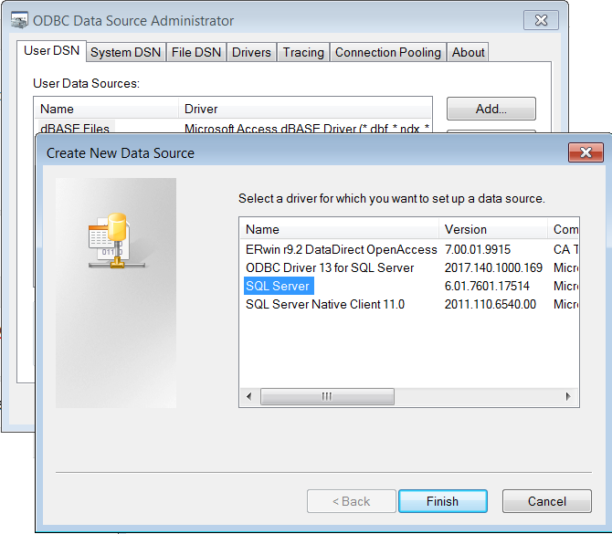

## Overview

There are three ways one can connect to a database: Native R Drivers, ODBC, and JDBC.  These are described below.

| Type | Description |
|------|-------------|
| Native R Drivers | An R package that provides a native database driver (such as RPostgresSQL). This provides direct access to a database through R. |
| ODBC | ODBC (Open Database Connectivity) require you to setup a database connection at the operating system level.  Your OS will need the drivers installed to connect to different types of databases.  You will then be able to open this connection in R by its name.  The "odbc" and "RODBC" libraries in R are used for these types of connections (but "odbc" is preferred because it is DBI compliant). |
| JDBC | JDBC (Java Database Connectivity) connects to a database through Java.  Java's JDBC drivers for various libraries need to be available on your computer, and Java also needs to be installed.  The "RJDBC" library in R is used for these types of connections. |

Hadley Wickham suggests that these should be preferred in the order they are given ([see his comment here](https://community.rstudio.com/t/why-does-rstudio-documentation-recommend-odbc-vs-jdbc-drivers/2381/4)).  The reasons are both speed and ease of configuration.  (JDBC is last because it is considered the most difficult to configure and may have performance disadvantages.  However, it does offer consistency of deployment since Java can be deployed anywhere and the same drivers used.  It also offers more advanced type safety and consistency of SQL dates.)

## DBI Standards

Really, the key to writing good database code is to write to the DBI specifications.  Drivers that are DBI-compliant interact with databases in the same way.  Mainly, they use functions like:

```
sql <- "SELECT * FROM STORES WHERE STORE_ID = '123'"
dbGetQuery(conn, sql)
```

Now, the difficulty with this is that there is no checking for SQL injection attacks in the SQL.  This is where the RJDBC library goes off the DBI path and offers a syntax using Java PreparedStatements like this:

```
sql <- "SELECT * FROM STORES WHERE STORE_ID = ?"
dbGetQuery(conn, sql, "123")
```

The code above is not DBI compliant, and if you use it your code will only work with the RJDBC database connections.

The DBI solution to this problem (as described [here](https://shiny.rstudio.com/articles/sql-injections.html)) is:

```
library(DBI)
sql <- "SELECT * FROM STORES WHERE STORE_ID = ?store_id"
query <- sqlInterpolate(conn, sql, store_id="123")
dbGetQuery(conn, query)
```

This is the convention used in R notebooks when you use the "sql" code block.  Variables that you want to inject are specified as "?variable_name" and you then provide the values for these parameters when you call sqlInterpolate.  Numbers will be converted to text and strings will be properly escaped and enclosed in quotes as needed by the database.  I am not sure how this handles dates (they might still need to be passed in as strings and could be database-specific).  I am also not sure whether it does any additional checks against the database metadata to ensure type-safety.  If you want to manually escape a string you can also use "dbQuoteString".  In general, "sqlInterpolate" is preferred, but sometimes it is useful to have a condition that will optionally include parameters.  This can be accomplished with:

```
sql <- paste(
  "SELECT * FROM STORES",
  if(!is.na(STORE_TYPE)) {paste0("WHERE STORE_TYPE = ", dbQuoteString(conn, STORE_TYPE))},
  "FOR READ ONLY WITH UR"
)
```

For some good resources on these issues see:

* [Selecting a Database Interface](https://db.rstudio.com/best-practices/select-interface/)
* [Database Basics: dplyr and DBI](https://shiny.rstudio.com/articles/overview.html)
* [SQL Injection Prevention](https://shiny.rstudio.com/articles/sql-injections.html)

## ODBC Connections

### Setting up an ODBC Connection

ODBC connections are configured through Windows.  You will need to access the "ODBC Data Source Administrator" from the Control Panel.  (Simply open the control panel and search "odbc" to find this.)  Here you can add a new connection.  It will prompt you to select the database type from the available drivers:



When you click "Finish" you will be given a wizard to configure the given database type.  For SQL Server databases you will need to provide a name, description, and the server to connect to.  Then it will ask you to provide login credentials.  These credentials will either be an account provided to you by the database administrator or you can use built-in Windows authentication to connect using whatever account you are currently logged into Windows with.  It is a good idea not to use your personal account in these connections.  Instead, use either a service account or built-in Windows authentication.  If you use your personal account, you will have to reconfigure the ODBC connection every time your password changes.

### odbc Library (preferred)

```
library("odbc")
conn <- dbConnect(odbc::odbc(), dsn="odbc_connection_name")

df <- dbGetQuery(conn, "SELECT * FROM test")

dbDisconnect(conn)
```

### RODBC Library

Warning: Do not use the "RODBC" library if possible. Instead, use "odbc". The "odbc" driver is preferred because it is DBI compliant and will allow users to switch database drivers and still run your code. See notes [here](https://db.rstudio.com/best-practices/select-interface/) for more detail.

Once the connection is setup, you can load the "RODBC" library and connect to it by name.  The example below shows how to do this and execute a simple SQL query:

```
library("RODBC")
conn <- odbcConnect("odbc_connection_name")

df <- sqlQuery(conn, "SELECT * FROM test")

odbcClose(conn)
```

## JDBC Connections

A JDBC connection first requires Java to be available and accessible from R.  Setting up this bridge can be a bit difficult.  It requires setting the "JAVA_HOME" environmental variable on the system.  Sometimes it is easier to just set this variable in the R script itself:

```
JAVA.DIR <- "C:\\Users\\<user>\\Documents\\R\\jdk-1.7.0_21"
JDBC.DIR <- "C:\\Users\\<user>\\Documents\\R\\jdbc"
#JDBC.DIR <- "C:\\Program Files\\DbVisualizer\\jdbc"   # If you have DbVisualizer, you might have drivers already installed here

Sys.setenv(JAVA_HOME=JAVA.DIR)
Sys.setenv(PATH=paste0(JAVA.DIR,"\\jre\\bin\\server;",Sys.getenv("PATH")))

library("RJDBC")
```

The commands above define the ```JAVA_HOME``` variable and point it to an installation of Java.  It also adds ```$JAVA_HOME/jre/bin/server``` to the system search path so that R can connect to the ```jvm.dll``` program on Windows and create the bridge to Java.  This must be set before loading the "RJDBC" library in order to initialize Java correctly.

We also setup a variable called "JDBC.DIR" which points to the location of database drivers on the system.  This can be helpful for defining database connections in a consistent manner.  The example below defines a function to connect to a SQL Server database.  It expects the JDBC driver for this type of database to be found at ```$JDBC.DIR/jtds/jtds.jar```.  (Database drivers in JDBC are typically just a ".jar" file which contains the compiled Java code needed to communicate with the database).

```
db.connect.sql_server <- function(jdbc.url, user, pass) {

  # Connect to a Microsoft SQL Server instance using the jTDS driver:

  drv <- JDBC(
    "net.sourceforge.jtds.jdbc.Driver",
    paste0(JDBC.DIR, "\\jtds\\jtds.jar"),
    identifier.quote='"')

  dbConnect(drv, jdbc.url, user, pass)
}
```

Once this "helper function" is defined, you can connect to the database with something like:

```
conn <- db.connect.sql_server(
  "jdbc:jtds:sqlserver://myserver.company.com:1433/OENet;Instance=dbname",
  "user", "password"
)
df <- dbGetQuery(conn, "SELECT * FROM test")

dbDisconnect(conn)
```

This connects using a JDBC connection URL, a user name, and password.  Documenting the connection URL's is beyond the scope of this reference.  There is ample documentation available in the many Java references.  Each database vendor also provides documentation on how to connect to their databases.  Typically, the URL will begin with "jdbc:".  It will then contain an indicator for the type of database.  This tells Java which driver to load.  In the above example "jtds:sqlserver" is what prompts Java to load the "jTDS" database driver and connect to a SQL Server database.  The remainder of the URL (after the "://") then indicates the server, port, and database/schema to connect to.  It may also contain parameters specific to the type of database being used.

The following code defines several "helper functions" like the ones above to connect to various types of databases:

```
db.connect.sql_server <- function(jdbc.url, user, pass) {
  # Connect to a Microsoft SQL Server instance using the jTDS driver:
  drv <- JDBC(
    "net.sourceforge.jtds.jdbc.Driver",
    paste0(JDBC.DIR, "\\jtds\\jtds.jar"),
    identifier.quote="`")
  dbConnect(drv, jdbc.url, user, pass)
}

db.connect.netezza <- function(jdbc.url, user, pass) {
  # Connect to a Netezza database:
  drv <- JDBC(
    "org.netezza.Driver",
    paste0(JDBC.DIR, "\\netezza\\nzjdbc.jar"),
    identifier.quote="`")
  dbConnect(drv, jdbc.url, user, pass)
}

db.connect.db2 <- function(jdbc.url, user, pass) {
  # Connect to a DB2 database:
  drv <- JDBC(
    "com.ibm.db2.jcc.DB2Driver",
    paste0(JDBC.DIR, "\\db2\\db2jcc4.jar"),
    identifier.quote="`")
  dbConnect(drv, jdbc.url, user, pass)
}

db.connect.informix <- function(jdbc.url, user, pass) {
  # Connect to an Informix database using Ifx JDBC 2.21 driver
  drv <- JDBC(
    "com.informix.jdbc.IfxDriver",
    paste0(JDBC.DIR, "\\ifxjdbc\\2.21\\ifxjdbc-2.21.jar"),
    identifier.quote="`")
  dbConnect(drv, jdbc.url, user, pass)
}

db.connect.mysql <- function(jdbc.url, user, pass) {
  # Connect to a MySQL database
  drv <- JDBC(
    "com.mysql.jdbc.Driver",
    paste0(JDBC.DIR, "\\mysql\\mysql.jar"),
    identifier.quote='"')
  dbConnect(drv, jdbc.url, user, pass)
}
```

Ultimately, setting up connections in ODBC or JDBC involves about the same amount of effort.  It's just a matter of where that effort occurs.  ODBC will require the setup to occur at the Operating System level (typically Windows), whereas JDBC connections shift all of the configuration into the R code itself.

### Writing to a Table

With RJDBC you can write to a table using "dbWriteTable()".  This writes an entire data frame to the table. The data frame should have the same column names (and I think the same column order) as the table.  The easiest way I've found to do this is to use the "transmute()" function to make sure the data frame is in exactly the desired format:

```
dbWriteTable(conn, "my_table",
               df_my_data %>% transmute(
                 division      = Division,
                 store         = Store,
                 date          = as.Date(Date),
                 ...
               ),
               append=TRUE, overwrite=FALSE)
```

## Connecting to Google Big Query

When using bigrquery, R will use web authentication for your Google Account. There is a one time process where you will have to save your key. After this, you will still need to go through the web authentication, but you will not be required to re-save the key. See the bigrquery documentation for more information. The first time using Big Query, you may also need to edit your .Renviron to setup an HTTP/HTTPS proxy.

If you haven't set up your .Renviron, run this command:

```
# Use this to easily edit your .Renviron
usethis::edit_r_environ()
```

Then, paste this block in the tab that opens in RStudio, save the file, then restart R. Session > Restart R (Ctrl + Shift + F10)

```
http_proxy=proxy.domain.com:port
http_proxy_user=ask
https_proxy=proxy.domain.com:port
https_proxy_user=ask
```

These are the connection details that you will need at the top of your script:

___Using bigrquery___

```
library(bigrquery)
library(DBI)

options(httr_oob_default = TRUE)

billing <- "your_billing_project"

conn <- dbConnect(
  bigrquery::bigquery(),
  project = "the_project_where_your_data_is_located",
  dataset = "you_schema",
  billing = billing
)
```
