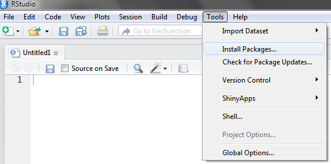
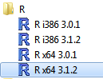
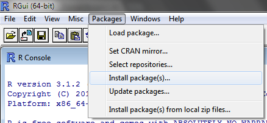

## RStudio

Packages are fairly easy to install (if you aren't behind a corporate firewall, that is).  In RStudio you need only select "Tools > Install Packages" from the menu bar, and a wizard will walk you through the process.



## R Classic with Proxy Authentication

If you're behind a corporate proxy you will want to keep this piece of code handy:

```
Sys.setenv(http_proxy = "http://yourproxy.domain.com/", http_proxy_user = "ask")
Sys.setenv(https_proxy = "http://yourproxy.domain.com/", https_proxy_user = "ask")

if (version$major <= 3 && version$minor < 3) {
  utils::setInternet2(FALSE)
} else if (version$major >= 3 && version$minor >= 3) {
  options(download.file.method= "internal")
} else {
  warning("unknown version number: ", version$major, ".", version$minor)
}

# FIX ERROR: unable to access index for repository https://cran.rstudio.com/src/contrib:
options(repos = c(CRAN = "http://cran.rstudio.com"))
```

This provides the address for corporate proxy and instructs R to prompt you for your password when it encounters the firewall.  However, this only works in R and does not work in RStudio.  You will need to open up basic R (see below):



If you are unsure what version of R you are using run "R.Version()" and it will tell you.  You will also want the 64 bit version when available.  Once you're in regular R, execute the "Sys.setenv" command above.  Then you can easily install packages by going to the menu and selecting "Packages > Install packages(s)":



The wizard will walk you through this process.

### HTTPS Errors

If you get an error about being unable to access HTTPS resources, then try this:

```
Run "chooseCRANmirror()" to select a new CRAN site
Select the "other" option: "44: (other mirrors)"
Select "(89: USA (CA 1))" mirror
```

This mirror uses HTTP instead of HTTPS, so it should be OK.  (NOTE: I tried selecting mirror "USA (OH 1)" which also indicated it was HTTP, but this didn't work.  Not sure why.  But try the above if you get stuck.

### Unable to Access Index Error

Another error I've seen looks like this:

```
Warning: unable to access index for repository https://cran.rstudio.com/src/contrib:
  scheme not supported in URL 'https://cran.rstudio.com/src/contrib/PACKAGES'
```

In this case the fix was to run:

```
options(repos = c(CRAN = "http://cran.rstudio.com"))
```

## "Old School" Commands

If you'd like to go "old school", you can also install packages using the R command:

```
install.packages(c('data.table', 'dplyr', 'sqldf'), repos = "http://cran.us.r-project.org", dependencies=TRUE)
```

This will still require the "Sys.setenv" command to be run beforehand if you are inside a corporate proxy.

## Installing Packages on a Server without Internet Access

There may also be times where you need to install packages on a server without internet access.  If the server has the same Operating System and version of R as your desktop, you can simply copy over the libraries.  On a Windows desktop, they are located in: ```C:\Users\[USERID]\Documents\R\win-library```.  If the server has a different OS things get a bit trickier.  You actually have to download the source code for the libraries, transfer these over to the server, and then install the packages from source.  The server will need to compile the libraries in this case so that they are compatible with its OS.  The following code will help perform the install:

```
# NOTE: This process is documented online at:
# http://stackoverflow.com/questions/10807804/offline-install-of-r-package-and-dependencies/10841614#10841614

### STEP 1: Download packages (in source form) to your desktop ################
#   (run the following commands on your desktop)

# Configure proxy settings (NOTE: Only works in R, not RStudio)
Sys.setenv(http_proxy = "http://proxy.domain.com/", http_proxy_user = "ask")
getPackages <- function(packs, which=c("Depends","Imports")){
  # Returns a list containing this package and all of its dependencies
  packages <- unlist(
    tools::package_dependencies(packs, available.packages(),
                                which=which, recursive=TRUE)
  )
  packages <- union(packs, packages)
  packages
}

# Download package and dependencies in source form to local folder:
packages <- getPackages("dplyr")
DEST.DIR <- "dest-dir"
download.packages(packages, destdir=DEST.DIR, type="source")

### STEP 2: Install these packages on secure server ###########################
#   (ftp the packages downloaded above over to the server.
#   Then run these commands in R on the server.)

INSTALL.DIR <- "/home/user/tmp/lib"
tools::write_PACKAGES(INSTALL.DIR)         # Creates a manifest of available packages
install.packages("dplyr", contriburl=paste0("file://", INSTALL.DIR))   # Installs packages from directory
```

NOTE: When I performed the above operation on a Linux machine, it also required an additional package named "BH" to be available in the package directory.  I believe this is an R package that assists in compiling the libraries from their source using gcc.
