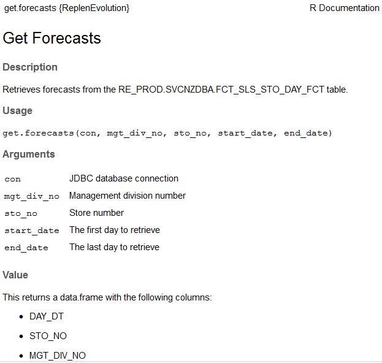

## Resources

Hadley Wickham has created a great resource for building your own R packages.  He actually has a whole book and a website devoted to that book freely available at:

* http://r-pkgs.had.co.nz/

There's also a more focused quick-start tutorial available at [this blog](https://hilaryparker.com/2014/04/29/writing-an-r-package-from-scratch/).

## Notes & Best Practices

At a high level, you'll want to do the following:

* Create your package as a project in R Studio
* Edit the R files in the "R" directory
* Edit the "DESCRIPTION" file to provide an overview of your project
* Re-load your package for testing using "devtools::load_all(path)"
* Use Roxygen2 to document your package (you can re-build your documentation with "devtools::document()")
* Save all your work using git/stash

I haven't figured out the best way to install these packages.  You can use "devtools::install_local(path)" to install it from a local folder.  This will copy it into your R library folder and then make it available as "library("packageName")".  It would be cool if we had something similar to "devtools::install_github(path)" which would install the packages using our internal Stash/Bitbucket repository.  Then team members wouldn't have to download the complete project and re-build it themselves.  More to come on this in the future.

## R Files & Documentation

Many complex packages try to maintain a clean layout by putting each function into its own file.  An example of a package that does this really well is the "mlr" machine learning package.  See its [github project](https://github.com/mlr-org/mlr/tree/master/R) for an example.  Below is an example of good documentation for a function:

```
#' @title Get Forecasts
#' @description
#' Retrieves forecasts from the RE_PROD.SVCNZDBA.FCT_SLS_STO_DAY_FCT table.
#'
#' @param con JDBC database connection
#' @param mgt_div_no Management division number
#' @param sto_no Store number
#' @param start_date The first day to retrieve
#' @param end_date The last day to retrieve
#'
#' @return
#' This returns a data.frame with the following columns:
#'
#' \itemize{
#'   \item DAY_DT
#'   \item STO_NO
#'   \item MGT_DIV_NO
#'   \item BAS_GRP_ID
#'   \item SUBCOMMODITY_CD
#'   \item HBT_FCT_03D_AMT
#'   \item HBT_FCT_07D_AMT
#'   \item FCST.SYS_BYS_FCT_03D_AMT
#'   \item FCST.SYS_BYS_FCT_07D_AMT
#'   \item FCST.CAO_RAVG_FCT_03D_AMT
#'   \item FCST.CAO_RAVG_FCT_07D_AMT
#' }
#'
#' @examples
#' get.forecasts(con, "014", "00423", "2017-12-01", "2017-12-07")
#'
#' @export
get.forecasts <- function(conn, mgt_div_no, sto_no, start_date, end_date) {

  df <- dbGetQuery(
    ...)

  df$DAY_DT <- as.Date(df$DAY_DT)

  df
}
```

This will render as:



Notice the important tags:

* title - The page title
* description - The high level description
* param - Defines a paramter (goes in the "Arguments" section)
* return - Describes the returned value (goes in the "Value" section)
* examples - Code samples (goes in the "Examples" section)
* export - Exports the function so that it can be used (DON'T FORGET THIS OR YOUR FUNCTION WILL BE HIDDEN INSIDE YOUR LIBRARY)

Here's Hadley Wickham's documentation on this documentation format:

http://r-pkgs.had.co.nz/man.html

And here's a page with some notes on the Roxygen markup:

https://cran.r-project.org/web/packages/roxygen2/vignettes/formatting.html
