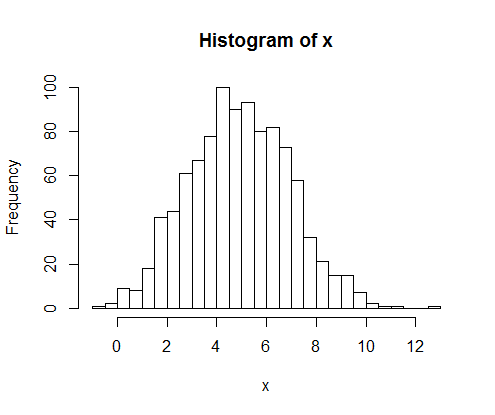

This page has example code for some common basic plots that can be produced in R.  Specialized libraries (ggplot2, chlorplethr) exist to do more advanced plotting.  These will documented on separate pages.

## Scatter Plots


```
x <- rnorm(100)
y <- rnorm(100)

plot(x, y,
  main="Scatterplot Example",
  xlab="X Axis", ylab="Y Axis")
```

The code above produces a sample scatter plot. The only required parameters are "x" and "y", but the others show how to change common labels.

You can change the symbol used to mark each point using the "pch" parameter.  It takes a numerical value corresponding to the shapes below.  ("pch=19" is a common choice. This produces a filled, circular dot.)


If you are trying to plot a lot of points at once, it may be difficult to get a good visualization.  Consider the code below for high-density plots.  It assigns a color using both RGB and an alpha value to make the dots semi-transparent.  This will intensify colors in places where dots overlap.  (NOTE: The default scatter plot also does a good job here. The reason it defaults to using a hollow circle for the marker is so that they naturally get darker for dense data.)


```
x <- rnorm(2000)
y <- rnorm(2000)

plot(x,y,
     main="High Density Scatterplot",
     col=rgb(38,69,110, 50,
             maxColorValue=255),
     pch=19)
```

Common Parameters:

```
main="Main Title"    # main title
sub="Sub Title"      # sub title
xlab="X Axis"        # label for X axis
ylab="Y Axis"        # label for Y axis
log="y"              # make the 'y' axis logarithmic (can also use ="x" or "=xy")
axes=FALSE           # supress axes
```

## Line Plots

Lines can be plotted using the same "plot" command.  You can pass in a single "y" vector to plot (in which case "x" will be 1:length(y)) or you can pass in both "x" and "y" vectors.  Both of the plot commands below plot the same graph.

```
x <- 1:20
y <- x * .5 + rnorm(20, 0, .5)

plot(x, y)
plot(y)
```

The "type" parameter is used to determine how to draw the line.  Common styles are shown below.


You can also plot multiple lines on one chart:

NOTE: For this type of plot, the ggplot2 library offers a lot more functionality and control of your plot and overlays.


```
y2 <- x * .3 + rnorm(20, 0, .3)

plot(x, y, col="blue", type="l")
lines(x, y2, col="red", add=T)
```

The "lines" command overlays a line graph on an existing plot.  Other useful overlays are:

```
points(x, y)   # overlays scatter plot
lines(x, y)    # overlays line with points (x,y)
abline(a, b)   # overlays line with intercept 'a' and slope 'b'
abline(h=y)    # overlays horizontal line with intercept 'y'
abline(v=x)    # overlays vertical line with intercept 'x'
abline(lm.obj)  # overlays line resulting from a linear relationship
title(main="", sub="")  # adds chart title (and subtitle)
```

## Histograms

Histograms are incredibly easy to produce in R.  These and boxplots are 2 types of charts that are actually easier to do in R than in Excel.  The basic histogram generated around a random vector of normally distributed data is shown below:



```
x <- rnorm(1000, mean=5, sd=2)

hist(x, breaks=30)
```

Note that 'breaks' can either be a number indicating the number of bins to use in the histogram, or it can be a vector containing specifical break points for each bin.

You can also fit a distribution to the data and plot the density curve overtop of it:


```
n.breaks <- 30
h <- hist(x, breaks=n.breaks, col="red",
          main="Histogram with Normal Curve")    # basic histogram

xfit <- seq(min(x),max(x),length=n.breaks)       # x values of curve
yfit <- dnorm(xfit,mean=mean(x),sd=sd(x))        # y values of curve (PDF of normal curve)
yfit <- yfit * diff(h$mids[1:2])*length(x)       # normalize area of PDF to match bars
lines(xfit, yfit, col="blue", lwd=2)             # add line for distribution
```

Data can be smoothed out using a kernel density function.  The default "plot" command will just plot a black curve.  The area can be filled using the "polygon" command:


```
d <- density(x)
plot(d, main="Kernel Density")
polygon(d, col="red", border="blue")
```

You can also use the "sm" package to compare density plots from multiple distributions:


```
library(sm)
attach(mtcars)   # sample 'mtcars' dataset

# create value labels
cyl.f <- factor(
  cyl,
  levels= c(4,6,8),
  labels = c("4 cylinder", "6 cylinder", "8 cylinder"))
  # NOTE: use unique(cyl) to get unique values

# plot densities
sm.density.compare(mpg, cyl, xlab="Miles Per Gallon")
title(main="MPG Distribution by Car Cylinders")

# add legend via mouse click
colfill<-c(2:(2+length(levels(cyl.f))))
legend(locator(1), levels(cyl.f), fill=colfill)
# locator(1) will have the user click the mouse to specify x,y
```

## Box Plot

A simple box plot can be created with:


```
x <- rnorm(1000)

boxplot(x, horizontal=T, main="Sample Boxplot")
```

You can also group your data using categorical variables to create separate box plots.  A data frame is typically used in this case and the plotting is specified by a formula as shown below:


```
attach(mtcars)  # sample data set

boxplot(mpg ~ cyl, data=mtcars,
        main="Car Milage Data",
        xlab="Number of Cylinders",
        ylab="Miles Per Gallon")
```

This plot clearly shows that cars with more cyclinders get lower gas mileage.
