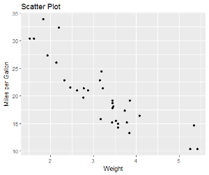
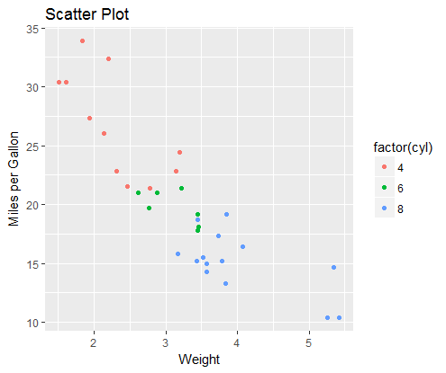
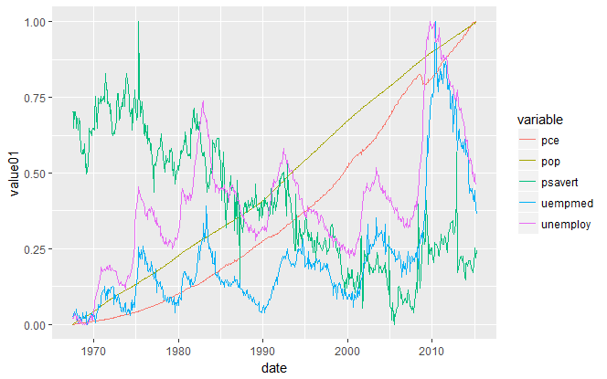
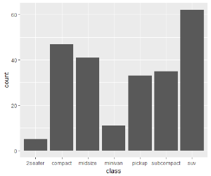
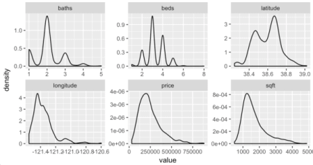
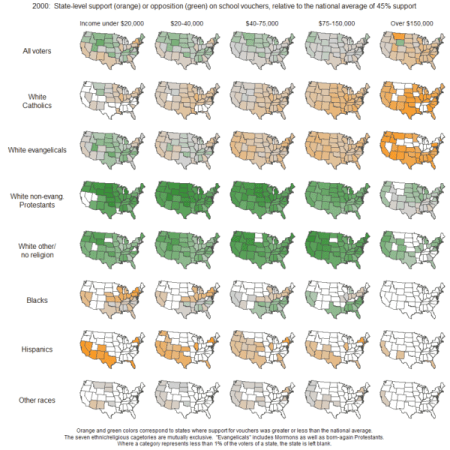
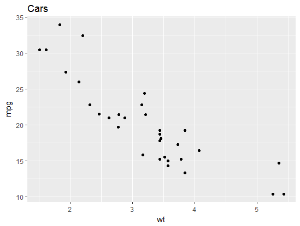
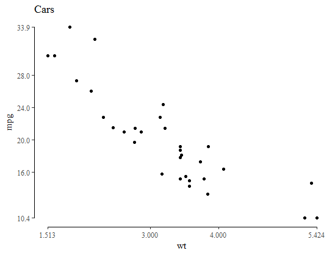
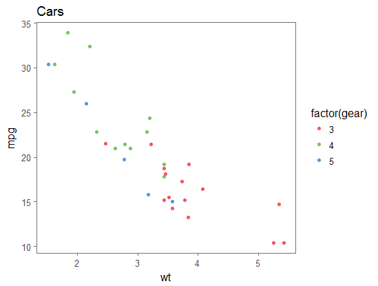
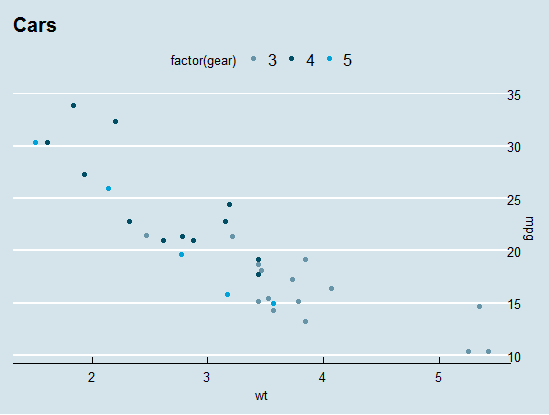

## Overview

ggplot2 is the "grammar of graphics" library developed by Hadley Wickham. It is capable of producing beautiful graphs with multiple overlays.  It also supports themes so that the same graph can be easily "re-skinned" to display with a different theme.  This is a good library to learn if you really want your plots to be pretty.

## Resources

Hadley Wickam’s Course Documents:  http://courses.had.co.nz/11-rice/

ggplot2 documentation: http://ggplot2.org/

## Scatter Plots

Reference: [geom_points() documentation](http://ggplot2.tidyverse.org/reference/geom_point.html)

The sample below shows how to construct a simple scatter plot.  Notice how the effects are layered on top of each other.  We begin each plot with a "ggplot()" call, specifying the data frame to display and usually an aesthetic grouping of variables (in this case an x and y plot of "wt" and "mpg").  We then turn it into a scatter plot by adding "geom_point()" to it.  We can also add labels using "lab()".  The result is stored in the variable "p" and is not displayed until we execute the line "p".  It is possible to not store the result at all and just display it right away by getting rid of the "p" assignment, but storing the plot is helpful if you plan to layer on additional parts later or to modify the displayed graph.



```
p <- ggplot(mtcars, aes(wt, mpg)) +
  geom_point() +
  labs(title="Scatter Plot", x="Weight", y="Miles per Gallon")
p
```

The points in a plot can also be easily colored based on the value of some other variable. This is done by specifying the "colour" aesthetic as shown below.



```
p <- p + geom_point(aes(colour = factor(cyl)))
p
```

Other supported aesthetics include:

* Gradient colors (based on the value of a continuous variable)
* Changing the size of each point based on another value
* Changing hte shape of each point based on another value

For examples see the [reference documentation](http://ggplot2.tidyverse.org/reference/geom_point.html).

## Line Plots
Reference: [geom_path() and geom_line() documentation](http://ggplot2.tidyverse.org/reference/geom_path.html)



```
ggplot(economics_long, aes(date, value01, colour = variable)) +
  geom_line()
```

## Bar Plots

Reference: [geom_bar() documentation](http://ggplot2.tidyverse.org/reference/geom_bar.html)



```
g <- ggplot(mpg, aes(class))
g + geom_bar()
```

## Small Multiples

According to [this article](http://www.dataarchitect.cloud/why-you-should-master-the-small-multiple-chart/) Edward Tufte once said that small multiples were a common solution to many data visualization questions:

> At the heart of quantitative reasoning is a single question: Compared to what?
>
> Small multiple designs, multivariate and data bountiful, answer directly by visually enforcing comparisons of changes, of the differences among objects, of the scope of alternatives. For a wide range of problems in data presentation, small multiples are the best design solution.
>
> – Edward Tufte

Small multiples means that you produce multiple versions of the same plot but with different data, separated by some categorical variable.

Examples of these charts include:





See [this page](http://www.dataarchitect.cloud/why-you-should-master-the-small-multiple-chart/) for more info and code samples.

## Themes

Reference: [ggthemes documentation](https://cran.r-project.org/web/packages/ggthemes/vignettes/ggthemes.html)

### Default Theme

One of the coolest features of "ggplot" is the ability to create themes to style graphs consistently.  The default theme is shown for comparison below:




```
p <- ggplot(mtcars, aes(x = wt, y = mpg)) +
  geom_point() +
  ggtitle("Cars")


p2 <- ggplot(mtcars, aes(x = wt, y = mpg, colour = factor(gear))) +
  geom_point() +
  ggtitle("Cars")


p
p2
```

### Tufte (Minimalist) Theme

The same chart can then be re-themed by adding a theme object to it.  An example of the minimalist Tufte theme is shown below:



```
p + theme_tufte()
```

### Stephen Few Theme



```
p2 + theme_few() + scale_colour_few()
```

### Tableau Colors

You can also change your color palettes using "ggthemes."  If you really like the Tableau color themes you can get these by simply using:

```
p2 + scale_colour_tableau()                  # default Tableau palette
p2 + + scale_colour_tableau("colorblind10")  # named Tableau palette
```

### Economist Theme



```
p2 + theme_economist() + scale_colour_economist() +
  scale_y_continuous(position = "right")
```

WARNING: Don't go too overboard with themes.  I once did a ton of charts using the Economist theme because I thought it was cool.  Really, a simpler theme (like Few's theme) would have been better. - Dan
