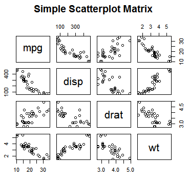
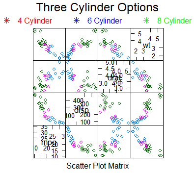
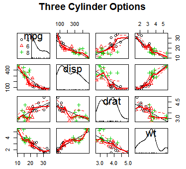
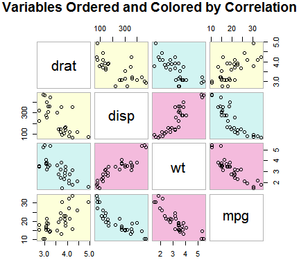
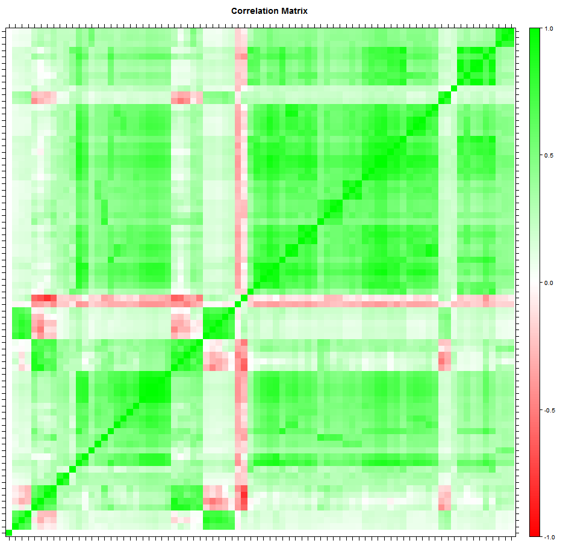
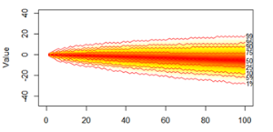
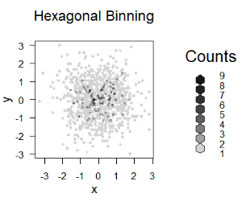
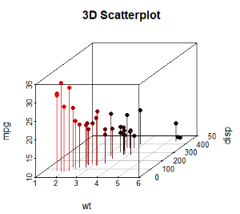
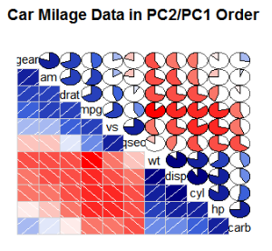

## Overview

Catch-all page for visualizations that don't fit well on other pages.  These are not frequently used types of plots, but it's good to know that they exist.  Many of the plots on this page will require add-in packages for R to produce.

## Pairs Plots

These types of plots are useful when building models to see how different variables your data set interact.  They can help you identify strongly correlated variables in your data set.  The downside to these plots is that they aren't really helpful for more than a few variables.

### Simple Pairs Plot (base package)



```
attach(mtcars)  # sample data set

pairs(~mpg+disp+drat+wt,
      data=mtcars,
      main="Simple Scatterplot Matrix")
```

### Other Pairs Plots



```
library(lattice)
splom(mtcars[c(1,3,5,6)], groups=cyl,
      data=mtcars,
      panel=panel.superpose,
      key=list(
        title="Three Cylinder Options",
        columns=3,
        points=20,
        col=c("red","blue","green"),
        text=list(c(
          "4 Cylinder",
          "6 Cylinder",
          "8 Cylinder"))
      )
)
```



```
library(car)
scatterplot.matrix(
  ~mpg+disp+drat+wt|cyl,
  data=mtcars,
  main="Three Cylinder Options")
```



```
library(gclus)
dta <- mtcars[c(1,3,5,6)]    # data
dta.r <- abs(cor(dta))       # cors
dta.col <- dmat.color(dta.r) # colors

# reorder variables so those with
# highest correlation
# are closest to the diagonal
dta.o <- order.single(dta.r)

cpairs(dta, dta.o, panel.colors=dta.col, gap=.5,
       main="Variables Ordered and Colored by Correlation")
```

## Correlation Matrix



A correlation matrix is another way to visualize correlated values in your data sets.  Since each variable intersection is just a colored square, this allows you to visualize more variables at once than the pairs plot.  The sample chart below looks for correlations in a data set containing about 80 different variables.  This chart was produced after grouping the variables by similarity to make these patterns more evident.

```
library("lattice")

df.covariance <- cov(df.current[,3:82], use="pairwise.complete.obs")
df.cor <- cov2cor(df.covariance)
colnames(df.cor) <- df.names$question

rgb.palette <- colorRampPalette(c("red","white","green"), space = "rgb")
levelplot(df.cor, main="Correlation Matrix",
          xlab="", ylab="",
          col.regions=rgb.palette(200),
          cuts=200, at=seq(-1,1,0.01))

### Cluster Questions by similarity and plot again ############################
# (not sure if this is helpful)

row.names(df.current) <- df.current$Store
df.by.q <- t(df.current[,3:82])
row.names(df.by.q) <- df.names$question

d <- dist(df.by.q)
#d <- as.dist(1-abs(cor(df.by.q)))
#d[is.na(d)] <- quantile(d, .95, na.rm=TRUE)
d[is.na(d)] <- quantile(d, .5, na.rm=TRUE)

hc <- hclust(d, method="ward.D2")
plot(hc, hang=-1)

library("ape")
plot(as.phylo(hc), cex=0.5, label.offset=1)

# Re-order data based on clustering and re-plot:

df.by.q.ordered <- df.by.q[hc$order,]
df.current.ordered <- t(df.by.q.ordered)

df.covariance <- cov(df.current.ordered, use="pairwise.complete.obs")
df.cor <- cov2cor(df.covariance)

rgb.palette <- colorRampPalette(c("red","white","green"), space = "rgb")
levelplot(df.cor, main="Correlation Matrix",
          xlab="", ylab="",
          col.regions=rgb.palette(200),
          cuts=200, at=seq(-1,1,0.01))
```

## Fan Plot

A fan plot shows a dispersion of values over time.  This can be used for showing uncertainty in results that usually increases with time.  The following chart shows the expected profit or loss of someone making a red/black bet in roulette.  The general trend is to lose money, but after 100 rounds it is possible to be up or to be down by about +/- $20.



```
library("reshape2")
library("fanplot")

# df.result is data frame containing columns 'run','t', and 'value'
# Multiple runs of a simulation were made and the value was recorded at each time step 't'
# 'dcast' is used below to re-cast the data to wide format with values for each run in a separate row.
# [,-1] is used to strip off the first column which contains values for 't'.  This leaves a matrix
# with runs in each row and the values at each time t in the columns.

m.sim <- as.matrix(dcast(df.result, run ~ t, value.var="value"))[,-1]

plot(NULL, main="Value over time",
     xlim = c(0,ncol(m.sim)),
     ylim = c(min(m.sim),max(m.sim)),
     xlab="Time", ylab="Value")
fan(data = m.sim, ln=c(.01,.05,.1,.25,.5,.75,.9,.95,.99))
```

## Other Plots

Why would anybody want to use these?  Not really sure.  But they were in my notes, so I'll add them.



```
library(hexbin)
x <- rnorm(1000)
y <- rnorm(1000)
bin<-hexbin(x, y, xbins=50)
plot(bin, main="Hexagonal Binning")
```



```
library(scatterplot3d)
attach(mtcars)
scatterplot3d(wt,disp,mpg,
              pch=16,
              highlight.3d=TRUE,
              type="h",
              main="3D Scatterplot")
```



```
library(corrgram)
corrgram(
  mtcars,
  order=TRUE,
  lower.panel=panel.shade,
  upper.panel=panel.pie,
  text.panel=panel.txt,
  main="Car Milage Data in PC2/PC1 Order")
```
