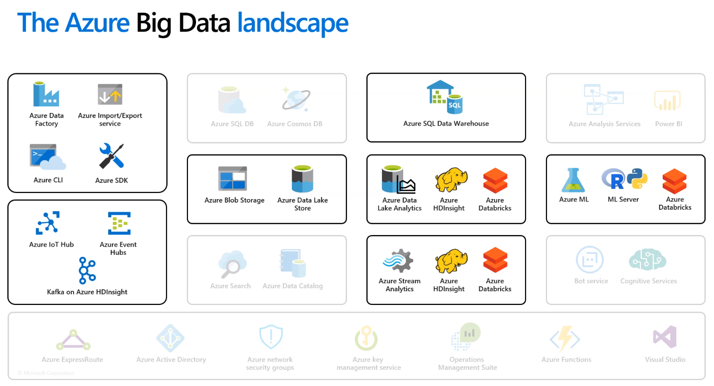

## Overview

The company I work for switched to Azure after spending a year trying to get going in Google Cloud.  Personally, I think I like GCP better for my own projects.  It's cheaper.  It focuses on delivering a few, high-quality services rather than a plethora of medium-quality ones.  It's well-documented, and it's well suited to Java/Python developers.  However, I have to admit that Azure is easier to get started in.  It feels more intuitive and they have two killer products: 1) DataBricks, and 2) Azure DevOps.  While DataBricks is too expensive for anything I'd ever develop personally, it's probably what we use 95% of the time at work.

## Key Services & Capabilities

### Compute

| Capability | Product | Description | Related Concepts |
|------------|---------|-------------|------------------|
| IaaS       | Virtual Machines |    | VM, GCE (Google Compute Engine), AWS EC2 (Elastic Compute) |
| PaaS       | Kubernetes Services   | Azure Container Service, Azure Service Fabric | Google Kubernetes Engine |
| Containers | App Service | Fully managed service for running and scaling apps in .NET, .NET Core, Node.js, Java, PHP, Ruby, or Python (Does "Cloud Services" do this too?) |
| Serverless Functions | Functions | Serverless functions | GCP Cloud Functions, AWS Lambda |

### Storage

| Capability | Product | Description | Related Concepts |
|------------|---------|-------------|------------------|
| Object / File Storage | Azure Blob Storage | Binary file storage (flat, non-hierarchical) | S3, GCS |
| Object / File Storage | ADLS (Azure Data Lake Storage) Gen2 | Improvement over basic blob storage that supports hierarchical file systems and POSIX-style permission on files and folders.  Data still can be exposed through blob storage API. |   |
| RDBMS | SQL Database | Other database types also supported | Cloud SQL |
| RDBMS | SQL Data Warehouse | Large data warehouses or an SQL interface to a data lake.  The data is separated from the compute and stored in column-oriented blobs.  A compute cluster can then be stood up (and scaled as-needed) to process this data.  Frequently used data is also cached in NVMe solid-state drives (which are 4-10 times faster than traditional SSD drives). | BigQuery? AWS Redshift? |
| NoSQL: Indexed | Cosmos DB | Planet-sized database indexed for fast retrieval. | Cloud Firestore |
| Time Series DB | Data Explorer | Azure is proud to offer the only fully-managed time series database.  According to their presentation (on 7/15) it is geared towards telemetry data from products like XBox or Microsoft apps.  It stores JSON messages in a way that allows for time series plotting and analysis as well as fast retrieval of individual messages.  This is used internally by Microsoft for customer support.  They can quickly find problems you are having and track specific messages through their systems using a correlation ID.  They mentioned that you can all of this in Cosmos DB but it wouldn't be very fast and might be expensive. KQL query language for querying these from apps or other clients | Splunk |

### Data Movement

| Capability | Product | Description | Related Concepts |
|------------|---------|-------------|------------------|
| ETL        | Azure Data Factory | Provides the ability to orchestrate ETL workflows.  Everything is defined in JSON files, but a GUI was added to make this a simple drag-and-drop type tool.  ADF supports many different sources and targets and breaks workflows down into activities that can be orchestrated or kicked off in response to triggers.	| Informatica, Talend |
| Streaming Messages | Event Hub |   | Google Cloud PubSub |

### Other

| Capability | Product | Description | Related Concepts |
|------------|---------|-------------|------------------|
| Job Orchestration | Azure Batch | Tool for spinning up a cluster of VMs to run jobs in parallel.  There are multiple ways to invoke these jobs, including the Azure UI and an SDK.  VMs can be spun up with pre-defined images and run whatever command you'd like. This was proposed as a way to quickly move embarassingly parallel jobs to Azure.  This may be an option we consider for the R Processor. | R Processor, PBS System (Unix) |

## Big Data and Machine Learning

| Product    | Description                                  |
|------------|----------------------------------------------|
| Databricks | Databricks allows you to create Spark clusters and then provides a UI for managing them, writing code (in notebooks), and running/scheduling jobs on the clusters.  This is a key component of many company's ETL and data science strategies. |
| HDInsight	HDInsight is a managed Hadoop cluster.  This is mainly used by clients who need to support legacy Pig / Hive jobs. |
| Data Lake Analytics | Microsoft does not really recommend using this.  They say it is used a lot internally at Microsoft and works well for companies that have a lot of C# + SQL developers (which Microsoft has), but they don't see a lot of use cases elsewhere.  There also isn't a lot of active development on this.  ___Recommendation:___ don't use. |
| Stream Analytics | Embed analytics into streaming data.  This is intended to be easy-to-use if you know how to write SQL.  They even say that business users should be able to use this to create a streaming dashboard. |
| Azure ML | Notebook-based environment for doing data science.  This can connect to compute resources such as VMs or DataBricks.  It assist with notebook sharing and model development/storage/evaluation/deployment. |
