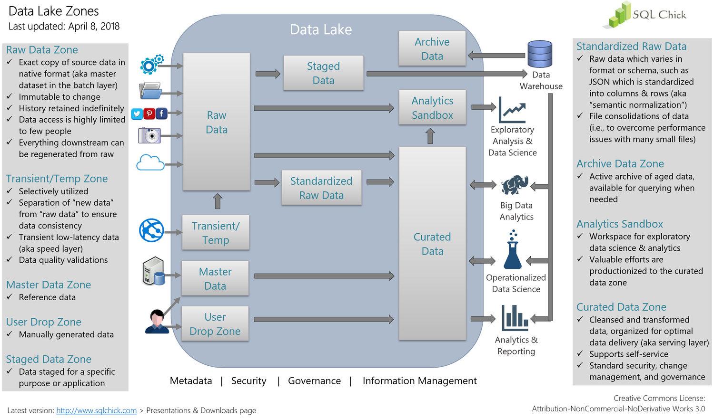
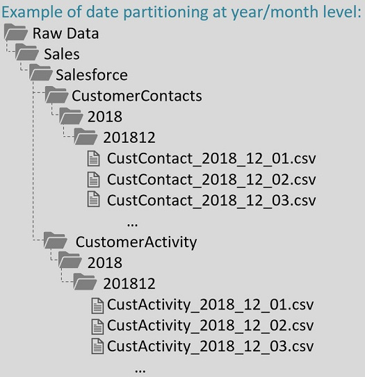

## Overview

If you're starting from scratch and trying to determine how to organize your ADLS or Blob storage, this can be intimidating.  While there doesn't seem to be a "best" approach, there are some pointers that can help.  Also, seeing how other people have organized lakes can be helpful.

## General Advice

In general, you will want to segregate your data by things like:

* Source
* Format
* Date
* Intended usage/consumption
* Administrative/security groups

The trick is figuring out what combination of these to use, and it may change based on where the data is being stored

## High Level Organization: Data Zones

It is common to begin by dividing your data into different zones.  The most important of these are:

* Raw Data - Exact copy of data as it arrives to you (binary, compressed CSV, JSON, whatever...)
* Curated Data - Data prepared for a specific use case.  This data is cleansed and transformed to be easier to use

Frequently, teams will debate about how "curated" data needs to be.  The end users want very nice, clean, curated data sets that are built specifically for their use cases and are thus easy to consume.  If a centralized team is managing the data lake, they will want to keep the data near its raw form, since any additional processing costs money and eventually requires someone to own/support the transformation (and anything that can go wrong with it or anything needs to be changed with it).  They'll usually meet somewhere in the middle.  At my company, we also have a "staging" area which is somewhere between raw and curated:

* Staged Data - Data that is staged for a specific purpose or application

In the diagram below this would actually be considered "Standardized Raw Data", but whatever.  The intent is to transform your raw data into something a bit more useable (such as parquet files) to make it easier for end-users and intermediate users (data engineers) to consume.

The diagram below shows how these different "data zones" can fit into a larger enterprise picture:



source: [Zones in a Data Lake](https://www.sqlchick.com/entries/2017/12/30/zones-in-a-data-lake)

## Low-Level Organization: Folder Structure

Many of the zones in a data lake use a file-based organization structure.  This is where you might find yourself making hard decisions and wondering how the decisions you are making now will affect you long-term.  There is a good page of FAQs and advice here:

* [FAQs About Organizing a Data Lake](https://www.sqlchick.com/entries/2019/1/20/faqs-about-organizing-a-data-lake)

A sample folder layout from this site is:



Notice that the highest-level folder is "raw".  It then goes to "line of business", then data set, and then a specific piece of data (which is partitioned by date).  That is:

```
<zone>/<line of business>/<data set>/<year>/<yearmonth>/<file>
```

The author mentions that you can also partition by line of business first and then divide this into zones.  This makes it easier to grant access to all data for that line of business.  However, the author prefers the former layout (zone first) because you might not always want to expose too much data to your users.  Do they really need to see raw data, or are you going to prep it for them at least a little bit first?  Both approaches ("zone then line of business" or "line of business and then zone") are common.

The author has firmer advice when it comes organization within the data sets folders.  In here, she advocates that:

* All files within the lowest-level folders should have the same schema
* Partition your data by date
* If you partition by date more than once (for example, year and then month) repeat everything you need to know about the date in the lower level folder name

The first rule means that if you have two types of files in your data set (example: one file with detail-level records and perhaps one with summary records), you should put them into separate folders.  Each of these would then be partitioned by date.  The date should be partitioned at whatever level makes sense for your data (yearly, monthly, daily, hourly).  You don't want to have too many files in a folder so it is typically helpful to create a high-level folder with just the year.  If you have daily data, you might have 365 files underneath this one (or 365 folders if you have multiple files for each day).
