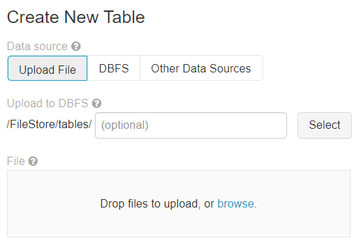
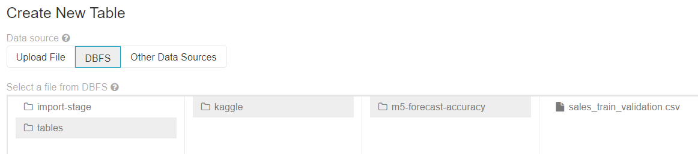

## Overview

DataBricks is a pretty cool service that makes Spark much more approachable by automating a lot of the cluster setup and administration.  A new user can setup a cluster in just a matter of minutes and then go straight to the notebook interface for writing code.  DataBricks and Spark are both pretty large topics.  This page is not intended to cover them all in detail.  Instead, it just keeps track of some notes and useful code samples I've come across.

## Cluster Creation
Cluster creation is so easy there really isn't much to document.  A new cluster can be created via the UI, and all the user really has to specify is the DataBricks/Python version they want to use, the machine type, and the number of nodes.  The clusters can auto-scale and automatically turn off if they are not used during a preset interval of time.

When creating a cluster you can largely stick to the defaults.  One important thing you might want to add in the advanced configuration options is:

```
spark.databricks.passthrough.enabled true
spark.databricks.delta.preview.enabled true
```

The pass-through authentication will access data in the data lake using the same credentials with which you are logged into DataBricks.

## Reading Data from File-Like Sources

DataBricks can read data from a variety of sources included several types of file systems, blob storage, and databases.  For file-like data, you have two options:

* Mounting the file storage to an internal directory
* Interfacing directly with the file storage without mounting anything

I've seen weird things happen with the first approach (like folders not being accessible if they were created after the mount or permissions issues based on who created the mount), so I've stuck largely with the second option.  This involves specifying a URL such as:

```
RAW_STORAGE = "abfss://raw@storageaccount.dfs.core.windows.net"
```

Credentials are handled different ways for different file systems, but once these are setup, interacting with them is pretty consistent.

Tools like "dbutils.fs" can interact with these URLs.  For instance, you can list all the files in a directory with:

```
files = dbutils.fs.ls(RAW_STORAGE + "/path/to/dir")
for file in files:
  print(file.name)
```

Typical Spark commands can also read data from files such as:

```
df_item = spark.read.format("parquet").load(RAW_STORAGE + "/path/to/parquet")
```

### Azure Blob Storage

```
URL = "wasbs://container@<storage-account-name>.blob.core.windows.net"

# Authenticate with secret key:
spark.conf.set("fs.azure.account.key.<storage-account-name>.blob.core.windows.net", "<secret>")
```

### Azure Data Lake Storage (Gen 2)

```
URL = "abfss://<container>@<storage-account-name>.dfs.core.windows.net"

# Authenticate with secret key:
spark.conf.set("fs.azure.account.key.<storage-account-name>.dfs.core.windows.net", "<secret>")
spark.conf.set("fs.azure.account.auth.type.<storage-account-name>.dfs.core.windows.net", "SharedKey")

# Authenticate with service principal:
spark.conf.set("fs.azure.account.auth.type.<storage-account-name>.dfs.core.windows.net", "OAuth")
spark.conf.set("fs.azure.account.oauth.provider.type.<storage-account-name>.dfs.core.windows.net", "org.apache.hadoop.fs.azurebfs.oauth2.ClientCredsTokenProvider")
spark.conf.set("fs.azure.account.oauth2.client.id.<storage-account-name>.dfs.core.windows.net", "<application-id>")
spark.conf.set("fs.azure.account.oauth2.client.secret.<storage-account-name>.dfs.core.windows.net", "<secret>")
spark.conf.set("fs.azure.account.oauth2.client.endpoint.<storage-account-name>.dfs.core.windows.net", "https://login.microsoftonline.com/<directory-id>/oauth2/token")
```

I've also found it helpful to define functions to simplify this.  The code below provides set_key_auth() and set_oauth() functions to make it easier to set these.  It also pulls the credentials from a secret scope, which is the preferred way to do this.

```
RAW_URL = "abfss://raw@dataingestkrogerdevadls.dfs.core.windows.net"
STAGE_URL = "abfss://stage@dataingestkrogerdevadls.dfs.core.windows.net"

def set_key_auth(storage_account, key, storage_type="dfs"):
    storage_host = "{}.{}.core.windows.net".format(storage_account, storage_type)
    spark.conf.set("fs.azure.account.key.{}".format(storage_host), key)
    spark.conf.set("fs.azure.account.auth.type.{}".format(storage_host), "SharedKey")

def set_oauth(storage_account, directory_id, client_id, client_secret, storage_type="dfs"):
    storage_host = "{}.{}.core.windows.net".format(storage_account, storage_type)
    spark.conf.set("fs.azure.account.auth.type.{}".format(storage_host), "OAuth")
    spark.conf.set("fs.azure.account.oauth.provider.type.{}".format(storage_host), "org.apache.hadoop.fs.azurebfs.oauth2.ClientCredsTokenProvider")
    spark.conf.set("fs.azure.account.oauth2.client.id.{}".format(storage_host), client_id)
    spark.conf.set("fs.azure.account.oauth2.client.secret.{}".format(storage_host), client_secret)
    spark.conf.set("fs.azure.account.oauth2.client.endpoint.{}".format(storage_host), "https://login.microsoftonline.com/{}/oauth2/token".format(directory_id))

set_key_auth("my_storage", key=dbutils.secrets.get("scope-name", "key-name"))

set_oauth("my-storage",
          directory_id  = dbutils.secrets.get("scope-name", "DIRECTORY_ID"),
          client_id     = dbutils.secrets.get("scope-name", "APPLICATION_ID"),
          client_secret = dbutils.secrets.get("scope-name", "CLIENT_SECRET"))
```

## DataBricks File System (DBFS)

You can explore the DBFS file system by running commands like:

```
%fs ls /
```

The basic DBFS folders you'll find in any workspace includes:

| Path       | Description                     |
|------------|-----------------------------------------------|
| /FileStore | Imported data files, generated plots, and uploaded libraries. |
| /cluster-logs | Cluster logs (this is configurable when you setup the cluster, so it may be in a different location) |
| /databricks-datasets | Sample public datasets. |
| /databricks-results | Files generated by downloading the full results of a query. |
| /user/hive/warehouse | Data and metadata for non-external Hive tables. |
| /ml | Special drive for high-performance file operations. dbfs:/ml maps to file:/dbfs/ml on driver and worker nodes. |

## Upload and Download Files

The easiest way to upload and download files to/from DataBricks is to use the DataBricks UI.  You can upload files by going to:

* The home page for your workspace and clicking "Import & Explore Data" (the middle column)
* "Data" on the sidebar and clicking the "Add Data" button

Both of these will take you to a screen that looks like:



You can select a file to upload from your local computer.  By default it will put it in "dbfs:/FileStore/tables/", but you can change that.

> WARNING: Make sure you change the path before uploading the file.  Otherwise it will upload it to the default directory.  You can always move it afterward though with "%fs mv".

After uploading a file you will see a button to "Create Table in Notebook".  This will create a new notebook with Spark code to read the data in your file from DBFS.  It will also contain commands to register the data as a temporary table, query the table, and also register it as a permanent file.

Files stored in "/FileStore" are accessible in your web browser at "https://<databricks-instance>/files/". For example, the file you stored in "/FileStore/my-stuff/my-file.txt" is accessible at "https://<databricks-instance>/files/my-stuff/my-file.txt?o=######" (where the number after o= is the same as in your URL.  It can be hard to browse files in this location (you cannot do it through a web UI).  One way is to pretend that you are uploading a file in the "Add Data" section and select "DBFS" as the source.  This gives you a browser like that below to browse files:



## Output Data to Files

If your program has produced an output that you'd like to save or retrieve to your computer, there are a few ways to do that:

### Option 1: Write Directly to ADLS

Spark will let you write your output directly to a file in ADLS using the "spark.write" command.  I've found this to be a bit tricky though.  If all I want is a CSV file, Spark likes to give me a folder of CSV files.  You can specify a partition of 1 and get 1 CSV file, but the interface is still a bit clunky.

### Option 2: Write to DBFS FileStore

As discussed earlier, you can download files from the DBFS "FileStore" folder through the web UI.  You can write to DBFS using either Spark commands or the native file system commands in Python and R.  These commands get a slightly different view of the file system than what you see in DBFS since they are looking at the actual file system on the Linux system where your code runs.  For instance, if you run:

```
%sh
ls -l /
```

You will see:

```
total 96
drwxr-xr-x   2 root   root    4096 Jan  6 22:10 bin
drwxr-xr-x   2 root   root    4096 Apr 12  2016 boot
-r-xr-xr-x   1 root   root      88 Jan  1  1970 BUILD
drwxr-xr-x   1 root   root    4096 Mar  5 15:01 databricks
drwxrwxrwx   1 root   root    4096 Jan  1  1970 dbfs
drwxr-xr-x   7 root   root     560 Mar  5 15:01 dev
drwxr-xr-x   1 root   root    4096 Mar  5 15:01 etc
drwxr-xr-x   1 root   root    4096 May 17  2019 home
drwxr-xr-x  13 root   root    4096 May 17  2019 lib
drwxr-xr-x   2 root   root    4096 Feb 22  2019 lib64
drwxr-xr-x   7 ubuntu ubuntu  4096 Mar  5 15:05 local_disk0
drwxr-xr-x   2 root   root    4096 Feb 22  2019 media
drwxr-xr-x   1 root   root    4096 Mar  5 15:01 mnt
drwxr-xr-x   3 root   root    4096 May 17  2019 opt
dr-xr-xr-x 238 nobody nogroup    0 Mar  5 15:01 proc
drwxr-xr-x   1 root   root    4096 Mar  5 15:05 root
drwxr-xr-x  14 root   root     620 Mar  5 15:15 run
drwxr-xr-x   2 root   root    4096 Jan  6 22:09 sbin
drwxr-xr-x   2 root   root    4096 Feb 22  2019 srv
dr-xr-xr-x  12 nobody nogroup    0 Mar  5 15:01 sys
drwxrwxrwt   1 root   root    4096 Mar  5 16:30 tmp
drwxr-xr-x  10 root   root    4096 Mar  5 15:00 usr
drwxr-xr-x   1 root   root    4096 Mar  5 15:00 var
```

There are a lot of files here related to Spark, the various languages and libraries it supports.  You typically don't need to do anything with these.  The interesting part is "dbfs" folder.  This is a mount to the shared DBFS file system.  You can write a file to this with code like:

```
write.csv(df, file="/dbfs/FileStore/tables/my_data.csv")
```

Then you can download the file through the DataBricks web UI.

### Option 3: Write to DBFS and then Upload to ADLS

You can also save a file to DBFS and then upload to ADLS.  You can use "write.csv" to write to the local DBFS file mount and then upload to ADLS with:

```
%fs cp /FileStore/tables/my_data.csv abfss:/
/tmp@ordspadls.dfs.core.windows.net/tmp/my_data.csv
```

The only reason you'd want to use this last method to write to ADLS is if the Spark methods for writing directly to ADLS do not work for you for some reason.  In that case, you can use this method to get more control over the files you create.
