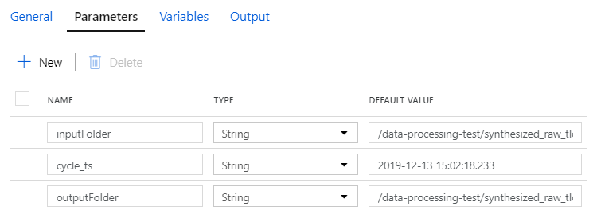

## Overview

Spark can be leveraged as an ETL tool in the cloud.  In fact, AWS Glue - which moves data from traditional databases to the cloud - is based upon Spark.  While Spark can also be used extensively for Data Science, this page intends to document portions of Spark that are particularly relevant to ETL.

## Architecture

At a high-level, many companies divide their data lake into 3 stages:

* Raw - Source data in whatever format it arrives (example: ".csv.gz")
* Stage - Data converted to standard format (parquet) but otherwise unchanged.
* Curated - Data transformed for a specific purpose.  This will impose a data model (at least in terms of naming consistency) and allow data to be easily understood and processed.

Spark jobs will be key in transforming the raw data to parquet format for staging.  They will also be central to the transformation process from stage to curated.  Techniques for accomplishing these transformations are discussed here.

## Sample Jobs

### Raw-to-Stage

The following code will read a CSV file and transform it to parquet.  The input file and output folder can be passed in as parameters (or specified manually via widgets for testing/debugging).  In this sample we append a new column named "cycle_ts" to capture the current timestamp and use this to partition the output.  Each run of this job will create a new output folder named "cycle_ts=..." underneath the parent output folder.

___File: raw-to-stage.py___

```
## Input Parameters

dbutils.widgets.removeAll()
dbutils.widgets.text("inputFile", "/raw/system/logs/log.20200216.csv", "Source File (Raw)")
dbutils.widgets.text("outputFolder", "/stage/system/logs", "Output Folder (Stage)")

INPUT_FILE = dbutils.widgets.get("inputFile")
OUTPUT_FOLDER = dbutils.widgets.get("outputFolder")

## Initialization

# TODO: These should be passed in or initialized some other way
STORAGE_ACCOUNT_NAME = "datalakestorage"
STORAGE_ACCOUNT_KEY = "secretkey"

RAW_URL = "wasbs://raw@{}.blob.core.windows.net".format(STORAGE_ACCOUNT_NAME)
STAGE_URL = "wasbs://stage@{}.blob.core.windows.net".format(STORAGE_ACCOUNT_NAME)

spark.conf.set(
  "fs.azure.account.key.{}.blob.core.windows.net".format(STORAGE_ACCOUNT_NAME),
  STORAGE_ACCOUNT_KEY)

## Processing

df_item = spark.read.csv(RAW_URL + INPUT_FILE, header=True)

from pyspark.sql import functions as F
df_output = df_item.withColumn("cycle_ts", F.current_timestamp())

df_output.write.partitionBy("cycle_ts").format("parquet").save(STAGE_URL + OUTPUT_FOLDER, mode="append")
```

### Stage-to-Curated

The following code will read the file we just output to stage and do a simple aggregation on it before writing it out to curated.  Each job run will process data from a specific "cycle_ts" and output its results in a data set that is also partitioned by "cycle_ts".

___File: stage-to-curated.py___

```
## Input Parameters

dbutils.widgets.removeAll()
dbutils.widgets.text("inputFolder", "/stage/system/logs", "Source Folder (Stage)")
dbutils.widgets.text("cycle_ts", "2019-12-12 22:54:14.084", "Cycle Timestamp")
dbutils.widgets.text("outputFolder", "/curated/system/logs", "Output Folder (Curated)")

INPUT_FOLDER  = dbutils.widgets.get("inputFolder")
CYCLE_TS      = dbutils.widgets.get("cycle_ts")
OUTPUT_FOLDER = dbutils.widgets.get("outputFolder")

## Initialization

# TODO: These should be passed in or initialized some other way
STORAGE_ACCOUNT_NAME = "datalakestorage"
STORAGE_ACCOUNT_KEY = "secretkey"

STAGE_URL = "wasbs://stage@{}.blob.core.windows.net".format(STORAGE_ACCOUNT_NAME)
CURATED_URL = "wasbs://curated@{}.blob.core.windows.net".format(STORAGE_ACCOUNT_NAME)

spark.conf.set(
  "fs.azure.account.key.{}.blob.core.windows.net".format(STORAGE_ACCOUNT_NAME),
  STORAGE_ACCOUNT_KEY)

## Processing

df_item = spark.read.parquet(STAGE_URL + INPUT_FOLDER)

df_filtered = df_item.filter(df_item.cycle_ts == CYCLE_TS)

from pyspark.sql import functions as F
df_summary = df_filtered.groupBy(
  ...
).agg(
  F.sum('value').alias('value')
)

df_summary.write.partitionBy("cycle_ts").format("parquet").save(CURATED_URL + OUTPUT_FOLDER, mode="append")
```

## Running DataBricks Jobs through ADF

Once you have a DataBricks notebook in good shape, you can schedule it to run through ADF.  This is actually very simple to do.  Microsoft documentation is available here:

https://docs.microsoft.com/en-us/azure/data-factory/transform-data-using-databricks-notebook

You will need to:

1. Create a new connection to your DataBricks service
2. Create a new pipeline with just 1 activity: run DataBricks Notebook
3. Configure the activity (specifying the DataBricks connection and the path to your notebook)
4. Link up any parameters that you want to pass into the notebook

When creating the connection to the DataBricks service you will fill out a form that lets you provide:

* Connection name
* Description
* Integrated Runtime
* subscription
* DataBricks workspace
* Cluster Type (new, existing interactive cluster, existing instance pool)
* Access token

I like to use existing interactive clusters even though best pratice might be to spin up new ones for each job.  This is great for testing since you won't have to wait for the cluster to spin up to run your job.  It also gives you the option to pre-configure the cluster if you'd like (load libraries, mount file systems, or setup credentials to connect to other services).  If you'd like, you can spin up a new job cluster for each job.  You will need to specify all the configuration (number and type of nodes, Spark version, etc.), but it is completely customizable.

On your DataBricks Notebook activity, you can pass in parameters in the settings page.  The screenshot below shows 3 parameters.  The value of these parameters is being pulled from the pipeline parameters.


These could be passed into a notebook that defines the input parameters as widgets with:

```
dbutils.widgets.text("inputFolder", "", "Source Folder (Stage)")
dbutils.widgets.text("cycle_ts", "", "Cycle Timestamp")
dbutils.widgets.text("outputFolder", "", "Output Folder (Curated)")
```

In this example we have setup the parameters to reference the pipeline parameters.  These are defined at the pipeline level:



When you run the pipeline you will be prompted to enter values for these parameters.  This also makes it easier to inject the parameters into the pipeline if you run it automatically.  The parameters are passed down to the activity which passes them down into your notebook.

One really cool feature of ADF+DataBricks is that it saves a notebook for each activity run and lets you view it from ADF.  Clicking "details" by the pipeline run will bring up a link to the DataBricks notebook.  This will show you how long each cell took to execute, the output of each cell, and additional information such as the values of any parameters passed to the notebook.

## Best Practices for CI/CD Pipelines and Test-Ability

I won't pretend to have really figured out best practices yet, but I have found a lot of good resources with what appear to be good suggestions.  These are documented below.

### Separating "E", "T", and "L"

I don't know if it's a best practice, but I see a lot of references to the daria-spark library, and its EtlDefinition object.  This object is defined (in Scala) as:

```
case class EtlDefinition(
    sourceDF: DataFrame,
    transform: (DataFrame => DataFrame),
    write: (DataFrame => Unit)
) {

  def process(): Unit = {
    write(sourceDF.transform(transform))
  }

}
```

It lets you define your ETL job with:

```
val etl = new EtlDefinition(
  sourceDF = extractDF,
  transform = model(),
  write = exampleWriter()
)
```

and then run it with:

```
etl.process()
````

I don't think this is worth pulling the whole daria-spark library into your projects.  I'm not even sure I like using the EtlDefinition object.  But I do like the idea of:

* One function to read your data
* One function to transform your data
* One function to write your data

Building a separate function for each of these tasks will keep your code clean and even enable re-use of data sources and sinks.

### Idempotent Jobs

The CTO of Swoop gave a presentation at the 2016 and 2017 Spark Summit called "Bulletproof Spark Jobs".  Each talk is 30 minutes, and even though they had the same name the content differs slightly.  YouTube videos of his talk can be found at the links below:

* https://www.youtube.com/watch?v=uvAX7xmEprs
* https://www.youtube.com/watch?v=_VwyKCgG3mE

The speaker noted at over 90% of the problems with ETL jobs are "transient", meaning the problem goes away if you just wait and re-try the job later.  But he asks if your job can safely run a second time, or a third time if needed.  Idempotent jobs provide this capability: they will produce the same final state no matter how many times you run them.  In Spark, this is not straight-forward to achieve.  If you write files in "append" mode, you will add more and more records every time the job runs.  Instead, you have to write them in "overwrite" mode (or go manually delete all the data any prior runs before running).

The easiest way to get idempotent Spark jobs is to write your data to a specific partition and use "overwrite" mode.  For example, we ended up re-writing our "stage-to-curated" example to use the following code:

```
from pyspark.sql import functions as F

def read_stage_file(trn_dt, div_no):
    file_path = "{}/system/table/trn_dt={}/div_no={}".format(
        STAGE_URL, trn_dt, div_no
      )
    return spark.read.format("parquet") \
                .load(file_path)

def write_curated_file(df, trn_dt, div_no):
    out_file_path = "{}/system/table/trn_dt={}/div_no={}".format(
        CURATED_URL, trn_dt, div_no
      )

    print("Writing data to {}".format(out_file_path))
    df.write.format("parquet").save(out_file_path, mode="overwrite")

### Run #################################################################################

df_item = read_stage_file(TRN_DT, DIV_NO)

def transform(df_item):
    return df_item.groupBy(
        'div_no', 'trn_dt'
    ).agg(
        F.sum('value').alias('value')
    )

df_summary = transform(df_item).cache()

write_curated_file(df_summary, TRN_DT, DIV_NO)
```

Notice that when we read the staged data, we are reading from one specific partition ("trn_dt={}/div_no={}") and writing to one specific partition in curated ("trn_dt={}/div_no={}" again).  In this case we know our data files only contain information for a single division and transaction date.  Because mode is set to "overwrite", we can run this job as many times as we want and it will never duplicate any data.  We can still read these data sets without stepping down into the individual partition folders.  For example, we could read from:

```
{}/system/table
```

But we can't really write to the file using this path.  Doing so would force us to use "append" mode which would duplicate data each time we ran.  If we tried to use "overwrite" mode at this level it would delete the entire data set (all partitions) whenever we tried to write a single partition.

Writing jobs in this way is pretty cool, because it means you can recover from 90%+ of your problems by just running the job again.  The speaker also mentioned writing a framework that doesn't let your entire ETL job fail if only a few records are bad.  Instead, it pushes through the records it can and stores the errors in a separate location along with known error types and detailed stack traces.  He says that this has reduced troubleshooting time by 98%, making it much easier for data engineers to find out why particular jobs or records are failing in their ETL pipelines.

### Custom (Re-Usable) Libraries

The Microsoft CSE team recommends putting all your ETL code in Python/PySpark into a custom library that you reference in your DataBricks notebook.  The DataBricks notebook then just becomes a light-weight shell that marshals parameters into your code and returns results from it.  They said that this would make it easier to test your Python code (although we haven't actually done that yet).  We have seen that it helps with code re-use.  One function we wrote for our data transformation looked like this:

```
from pyspark.sql.types import LongType, StringType, StructField, StructType, BooleanType, ArrayType, IntegerType
from pyspark.sql import functions as F

def get_raw_file_path(cycle_date, div_no):
    return "{}/system/table/{}/file_{}_{}.csv.gz".format(
            RAW_URL, cycle_date, div_no, cycle_date)

def get_raw_file_schema():
    """Returns the schema for the raw file.  Since this is a CSV file (with
    no header) we have to specify everything explicitly.  All fields are loaded as
    strings.
    """
    cols = [
        ... about 35 different fields ...
    ]

    fields = list()
    for col in cols:
        fields.append(StructField(col, StringType(), True))

    return StructType(fields)

def load_raw_file(cycle_date, div_no):
    file_path = get_raw_file_path(cycle_date, div_no)
    schema = get_raw_file_schema()
    return spark.read.format("csv").schema(schema).load(file_path)
```

In this case we are reading a CSV file without a header, and we have to specify the entire schema (with all field names and optionally types) when we read it.  Imagine copying this code into each notebook that wants to read this file.  In this case it is much better to put functions like this in a library.  We did notice that our library couldn't access certain context objects like "spark" or "dbutils".  These had to be passed in to the classes/methods in our library.

Once you begin using libraries you will also have to figure out how/where to store those libraries and how to update and deploy new versions.  In our test we compiled the libraries into binary wheels and installed them on the DataBricks cluster manually.  It would be far better to setup a CI/CD pipeline to deploy your library artifacts somewhere (AzDO or Artifactory?) and then pull them into the cluster when the cluster is created.

### CI/CD Pipelines

The following page provides a good overview of how Microsoft recommends doing CI/CD deployments with Azure Data Factory jobs:

https://docs.microsoft.com/en-us/azure/data-factory/continuous-integration-deployment

In brief:

* You develop pipelines in a development ADF environment that with Git mode
  * Git mode means that all your configuration and pipelines are stored in version-controlled files in git
  * GitFlow is recommended for development:
    * Make changes on your own separate branch
    * Submit these via pull requests to merge back into the master branch
* When ready: use the "publish" button to create an ARM template that deploys your entire ADF environment into a test environment in Azure
* When test pass: take the same ARM template you already published and tested and deploy ADF into your production environment

The ARM template ensure that both test and production get exact copies of your development environment with all of its pipelines, connections, and any other configuration.  Any configuration that differs between these environments can be injected into the ARM templates.

A co-worker provided this link for CI/CD best practices for DataBricks:

* https://thedataguy.blog/ci-cd-with-databricks-and-azure-devops/

This page shows how to check your DataBricks notebook code into a git repository (specifically AzDO Repository) and setup build pipelines to deploy the notebooks as artifacts.  You can then write a release pipeline that deploys these to various environments as you promote them to stage and eventually to prod.

Another specialist from DataBricks provided these two links as well:

* https://datathirst.net/blog/2019/9/20/series-developing-a-pyspark-application
* https://medium.com/@bedatse/azure-devops-ci-cd-with-azure-databricks-and-data-factory-part-1-c05a44536a8e

TODO: Wrap all this up into one big recommendation?
