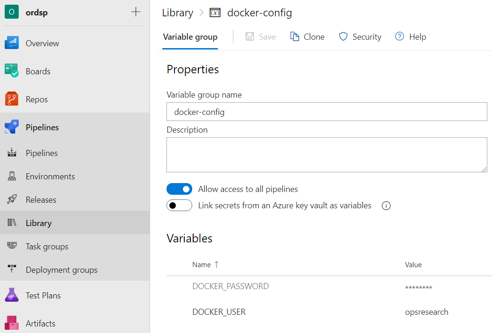
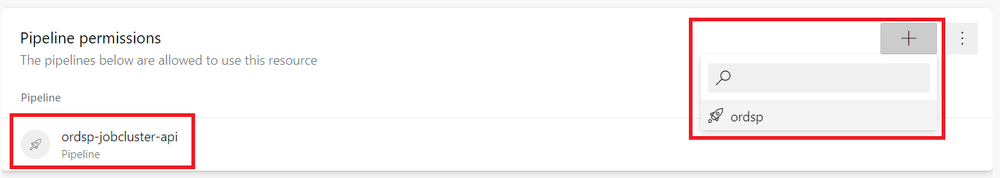
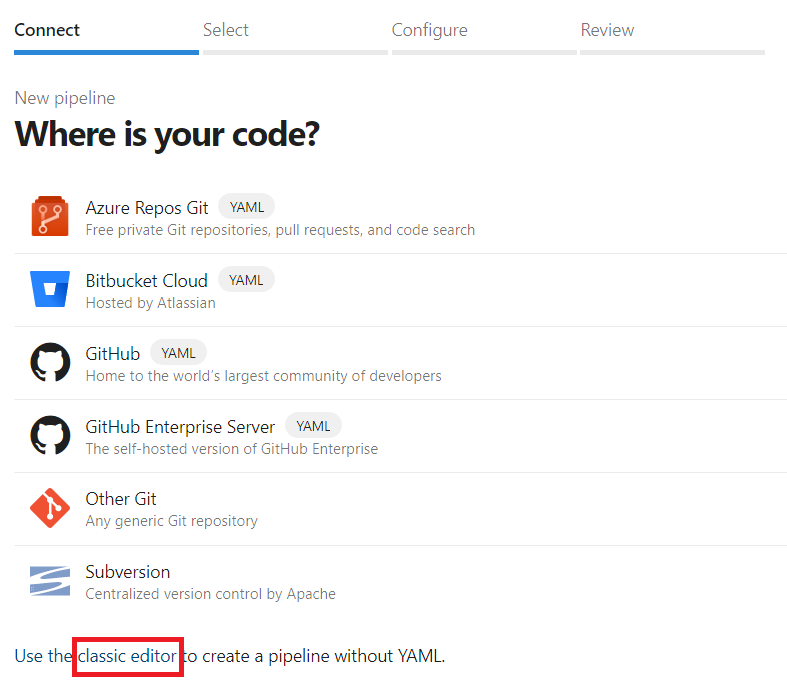

## Overview

One of the great features in Azure DevOps is the ability to use CI/CD workflows using its "Pipelines" feature.  Azure DevOps pipelines can take source code from a variety of locations (including AzDO or GitHub) and automatically build and deploy code whenever you commit code to your git repository.  So far our team has used this for:

* Building docker containers and pushing them to an Azure Container Registry
* Building Azure Functions apps and deploying them

This page will document how to do this.

## Docker Builds

### The Simple Path

AzDO contains a docker build task that can make things very simple (if you get lucky).  I've had a problem getting this to work in a corporate environment though since it requires the creation of a service connection from AzDO to Azure and I don't have permissions to create this.  If you do get it working you can have a build pipeline as simple as:

```
trigger:
- master

pool:
  vmImage: 'ubuntu-latest'

steps:
- task: Docker@2
  inputs:
    containerRegistry: 'myregistry'
    repository: 'samples/myimage'
    command: 'buildAndPush'
    Dockerfile: '**/Dockerfile'
```

This will find any Dockerfile in your project, build it, and push it the Azure Container Registry specified by the service connection "myregistry".  It will be named "samples/myimage" and tagged with the Azure pipeline build number.

### The Fully-Customizable Path

If the above doesn't work or if you need complete control over the build process, one solution is to use a build script such as:

___build.sh___

```
DOCKER_REGISTRY="myregistry.azurecr.io"
DOCKER_IMAGE="my-app"
IMAGE_VERSION="1.0"

docker logout $DOCKER_REGISTRY

docker build \
  -t "$DOCKER_REGISTRY/$DOCKER_IMAGE:$IMAGE_VERSION" .

echo "$DOCKER_PASSWORD" | docker login \
  -u $DOCKER_USER --password-stdin \
  $DOCKER_REGISTRY

docker push "$DOCKER_REGISTRY/$DOCKER_IMAGE:$IMAGE_VERSION"

docker logout $DOCKER_REGISTRY
```

This specifies the docker build, login, push, and logout commands explicitly.  The name of the registry, the image, and the version are all specified in the script.  We do inject two variables: DOCKER_USER and DOCKER_PASSWORD as environmental variables so that we don't have to commit any credentials to our repo.

With this script in your repo, you can then build a pipeline that simply executes the script:

___azure-pipelines.yml___

```
trigger:
- master

pool:
  vmImage: 'ubuntu-latest'

variables:
- group: 'docker-config'

steps:
- task: Bash@3
  inputs:
    targetType: 'filePath'
    filePath: my-project/build.sh
    workingDirectory: my-project
  env:
    DOCKER_USER: $(DOCKER_USER)
    DOCKER_PASSWORD: $(DOCKER_PASSWORD)
```

In the above example our build script lives in the folder "my-project".  We can set the working directory to run from inside this directory.  If not specified, it will run from the root directory of your project.

Notice once more that we inject DOCKER_USER and DOCKER_PASSWORD so they are visible in the script.  These are loaded from the variable group named "docker-config".  A variable group can easily be edited in the "Library" pane of AzDO:



## Azure Functions

The following is an example of a build pipeline that automatically builds and deploys an Azure Functions App:

___azure-pipelines.yml___

```
# Python Function App to Linux on Azure
# Build a Python function app and deploy it to Azure as a Linux function app.
# Add steps that analyze code, save build artifacts, deploy, and more:
# https://docs.microsoft.com/azure/devops/pipelines/languages/python

trigger:
- master

variables:
  azureSubscription: 'my-subscriptionP'
  functionAppName: 'myfuncapp'
  vmImageName: 'ubuntu-latest'
  workingDirectory: '$(System.DefaultWorkingDirectory)'

stages:
- stage: Build
  displayName: Build stage

  jobs:
  - job: Build
    displayName: Build
    pool:
      vmImage: $(vmImageName)

    steps:
    - bash: |
        if [ -f extensions.csproj ]
        then
            dotnet build extensions.csproj --runtime ubuntu.16.04-x64 --output ./bin
        fi
      workingDirectory: $(workingDirectory)
      displayName: 'Build extensions'

    - task: UsePythonVersion@0
      displayName: 'Use Python 3.6'
      inputs:
        versionSpec: 3.6 # Functions V2 supports Python 3.6 as of today

    - bash: |
        python -m venv worker_venv
        source worker_venv/bin/activate
        pip install -r requirements.txt
      workingDirectory: $(workingDirectory)
      displayName: 'Install application dependencies'

    - task: ArchiveFiles@2
      displayName: 'Archive files'
      inputs:
        rootFolderOrFile: '$(workingDirectory)'
        includeRootFolder: false
        archiveType: zip
        archiveFile: $(Build.ArtifactStagingDirectory)/$(Build.BuildId).zip
        replaceExistingArchive: true

    - publish: $(Build.ArtifactStagingDirectory)/$(Build.BuildId).zip
      artifact: drop

- stage: Deploy
  displayName: Deploy stage
  dependsOn: Build
  condition: succeeded()

  jobs:
  - deployment: Deploy
    displayName: Deploy
    environment: 'development'
    pool:
      vmImage: $(vmImageName)

    strategy:
      runOnce:
        deploy:

          steps:
          - task: AzureFunctionApp@1
            displayName: 'Azure functions app deploy'
            inputs:
              azureSubscription: '$(azureSubscription)'
              appType: functionAppLinux
              appName: $(functionAppName)
              package: '$(Pipeline.Workspace)/drop/$(Build.BuildId).zip'
```

NOTE: This script assumes that the Azure Function App is located at the root directory in your project.  If it is in a sub-directory, you can change the variable "workingDirectory" and append the path.

I just copied this code from somewhere, but you can kind of see what it is doing.  The pipeline has two stages: Build and Deploy.  The Build stage:

* Makes sure the dotnet extensions exist (if needed)
* Makes sure Python 3.6 is available
* Activates a Python virtual environment and installs all of the packages specified in "requirements.txt"
* Zips up the contents of the folder and puts it in a local "staging" folder
* Publishes the zip folder so that it is available to the "Build" stage

The build stage will then deploy the app using the zip folder from the previous step.  According to the docs, this step uses the REST API available in Azure.

### Service Connection

If you just copy the code above and run it, you will get an error that you reference an Azure subscription but don't have a service connection available for that.  In order to run successfully, you need to create a service connection to Azure that has the ability to deploy your Azure Functions app.  You can create this by navigating to "Service Connections" in AzDO settings.  The type of service connection is an "Azure Resource Manager" that we will setup to use a service principal.  You will need to fill out the:

* Connection name
* Subscription ID
* Subscription name
* Service principal client ID
* Service principal key
* Tenant ID

NOTE: There is a link you click on the simple config page to enter detailed configuration and get all of the fields above.

You will also need to make this service connection available to your pipeline.  You can do this by clicking the three dots next to the "edit" button when viewing the service connection info.

Once everything is configured you can use the connection name in your pipeline YAML file when it asks for the "azureSubscription".

This will take you to a page where you can specify which pipelines are allowed to use this connection.  You can easily add a new pipeline here.



## Multiple Pipelines for One Git Repo

If you find yourself wanting to setup multiple pipelines for a single git repo, there is a way to do that.  You can embed multiple pipeline YAML files in the project and use these to specify the pipelines.  Amusingly enough, you cannot configure the pipeline to use scripts in non-standard locations unless you go to the "classic editor" link on the "New Pipeline" page:



Once you do this you will be prompted to specify the location of your source code.  Then you can select "YAML Configuration" as an option.  When you do this, it will let you enter the path to the YAML file within your project.  You can use this approach to create as many pipelines in your repo as you'd like.  In practice I've only done this if I had a project that had docker builds and Azure Functions builds.  The Azure Function builds are so complicated that I wanted a pipeline that only contained these.  Then I put the docker builds into a separate pipeline.  The docker builds are simple enough that I didn't mind putting multiple docker builds into the same pipeline.

## Python Libraries

### Deploying to Artifactory

TODO

### Deploying to DataBricks

The following pipeline was taken from a project that built a Python library as a wheel and then uploaded it to a DataBricks cluster.  It also runs some unit tests on the package first before doing this build and deploy.  The key to the deploy are the "curl" commands near the end:

```
curl -H "Authorization: Bearer $(DBPAT)" \
  -F overwrite=true \
  -F contents=@dist/raw_to_stage_library-$(PACKAGE_MAJOR_VERSION).$(PACKAGE_MINOR_VERSION)-py3-none-any.whl \
  -F path="/FileStore/custom_python_libraries/raw_to_stage_library_latest.whl" \
  https://centralus.azuredatabricks.net/api/2.0/dbfs/put

curl -H "Authorization: Bearer $(DBPAT)" \
  -F overwrite=true \
  -F contents=@dist/raw_to_stage_library-$(PACKAGE_MAJOR_VERSION).$(PACKAGE_MINOR_VERSION)-py3-none-any.whl \
  -F path="/FileStore/custom_python_libraries/raw_to_stage_library_$(PACKAGE_MAJOR_VERSION).$(PACKAGE_MINOR_VERSION).whl" \
  https://centralus.azuredatabricks.net/api/2.0/dbfs/put
```

This uses the REST endpoint on the service to upload a file to the specified file paths.  Two wheels are deployed: one named "_latest" and another with the actual version number.  A personal access token is used to authenticate with API.  This is stored in the pipeline as a variable and accessed as $DBPAT.

Here is the complete AzDO pipeline that builds the libraries and deploys them to DataBricks:

```
azure-pipelines.yaml
trigger:
 branches:
   include:
     - master
 paths:
   include:
     - databricks/data_transform/raw_to_stage_library/*

pool:
 vmImage: "ubuntu-latest"

variables:
 WORKING_DIR: "databricks/data_transform/raw_to_stage_library"
 PACKAGE_MAJOR_VERSION: 0
 PACKAGE_MINOR_VERSION: 4

jobs:
 - job: test
   displayName: Run unit tests
   steps:
     - task: UsePythonVersion@0
       inputs:
         versionSpec: "3.7"

     - script: python -m pip install --upgrade pip
       workingDirectory: $(WORKING_DIR)
       displayName: "Install dependencies"

     - script: pip install -r requirements.txt
       workingDirectory: $(WORKING_DIR)
       displayName: "Install requirements"

     - script: python -m unittest --verbose
       workingDirectory: $(WORKING_DIR)
       displayName: "Run unittest"

 - job: publish
   displayName: Publish Python package
   dependsOn: test
   condition: succeeded()
   steps:
     - task: UsePythonVersion@0
       inputs:
         versionSpec: "3.7"

     - script: python -m pip install -U pip setuptools wheel dbutils
       displayName: Install build tools

     - script: ls dist
       workingDirectory: $(WORKING_DIR)
       displayName: List files

     - script: rm dist/*
       workingDirectory: $(WORKING_DIR)
       displayName: Clean distribution directory out

     - script: ls dist
       workingDirectory: $(WORKING_DIR)
       displayName: List files

     - script: python setup.py sdist bdist_wheel
       env:
         package_version: $(PACKAGE_MAJOR_VERSION).$(PACKAGE_MINOR_VERSION)
       workingDirectory: $(WORKING_DIR)
       displayName: Build package

     - script: ls dist
       workingDirectory: $(WORKING_DIR)
       displayName: List files

     - script: |
         curl -H "Authorization: Bearer $(DBPAT)" -F overwrite=true -F contents=@dist/raw_to_stage_library-$(PACKAGE_MAJOR_VERSION).$(PACKAGE_MINOR_VERSION)-py3-none-any.whl -F path="/FileStore/custom_python_libraries/raw_to_stage_library_latest.whl" https://centralus.azuredatabricks.net/api/2.0/dbfs/put
         curl -H "Authorization: Bearer $(DBPAT)" -F overwrite=true -F contents=@dist/raw_to_stage_library-$(PACKAGE_MAJOR_VERSION).$(PACKAGE_MINOR_VERSION)-py3-none-any.whl -F path="/FileStore/custom_python_libraries/raw_to_stage_library_$(PACKAGE_MAJOR_VERSION).$(PACKAGE_MINOR_VERSION).whl" https://centralus.azuredatabricks.net/api/2.0/dbfs/put
       workingDirectory: $(WORKING_DIR)
       displayName: Upload wheel to databricks file system
```
