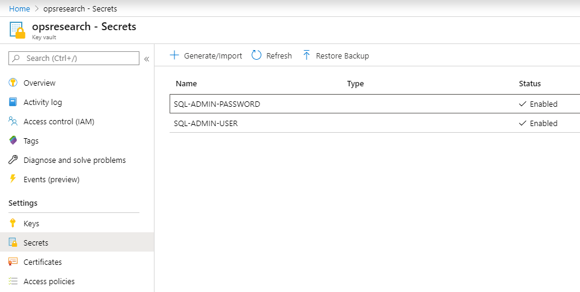

## Overview

Azure Key Vault is a way to store secrets and credentials in a secure manner.  It stores 3 types of information:

* Secrets - Any name/value pair (often used for passwords or service principal credentials)
* Keys - Public/Private Keys (RSA or EC keys)
* Certificates - SSL certificates

The screenshot below shows a key vault with 2 secrets in it.  These store the user name and password for a SQL Server instance.



## Access Policies

You might notice when you create a key vault you don't have permissions to actually read or write any keys by default.  This is because access policies to secrets inside key vault are managed separately from the IAM permissions that configure the resource itself.  You might be a contributor or owner on the key vault itself, but you will not be able to read or write data in the key vault until you setup an access policy to grant you that permission.

You can view access policies on the "Access policies" pane.  Normally, you'd be able to add new user policies here as well, but for some reason this doesn't work for most users.  You will likely get stuck at the part where you are asked to enter a user name or service principal.  It won't be able to search Azure Active Directory or find any users because this ability is restricted.  One way around this is to set policies manually from the Cloud Shell.  The command below is an example of one that sets a policy for a user and grants the typical set of permissions that you'd get as defaults in the GUI:

```
az keyvault set-policy \
  --name <keyvaultname> \
  --resource-group <resource-group> \
  --subscription <subscription> \
  --key-permissions get list update create import delete recover backup restore \
  --secret-permissions get list set delete recover backup restore \
  --certificate-permissions backup create delete deleteissuers get getissuers import list listissuers managecontacts manageissuers recover restore setissuers update \
  --object-id 12345678-1234-1234-1234-1234567890ab
```

In this case we use "--object-id" to specify the user getting these permissions.  The user ID can be found in Azure where you would go to view your user and group info.  Alternately, you can use "--upn" to specify a user principal (as an email address, I think).

## CLI Commands

Some other commands that may be helpful include the ability to list keys and retrieve key values from the command line.  This is especially useful for the key vaults that CIS creates for you, since you will not have access to the GUI to view these in Azure.  You can list secrets in the vault with:

```
az keyvault secret list --vault-name "kv-my-keyvault"
```

This will return something like:

```
[
  {
    "attributes": {
      "created": "2020-01-09T20:25:01+00:00",
      "enabled": true,
      "expires": null,
      "notBefore": null,
      "recoveryLevel": "Purgeable",
      "updated": "2020-01-09T20:25:01+00:00"
    },
    "contentType": "generated this automagicaly",
    "id": "https://kv-my-keyvault.vault.azure.net/secrets/my-secret",
    "managed": null,
    "tags": null
  }
]
```

You can then use the "id" for each key to view the actual secret value:

```
az keyvault secret show --vault-name "kv-my-keyvault" --id https://kv-my-keyvault.vault.azure.net/secrets/my-secret
```
