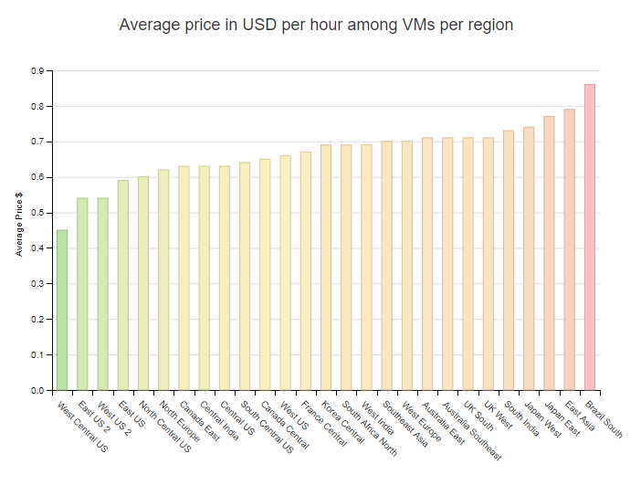

## Overview

Microsoft provides the following pages with information about their regions and data center locations:

* https://azure.microsoft.com/en-us/global-infrastructure/regions/ - Pretty map of all regions
* https://azure.microsoft.com/en-us/global-infrastructure/locations/ - Actual list of data center locations

Picking the right region is important because you want:

* A nearby location to minimize network latency
* A location that minimizes costs

Each region has different costs - which can make the trade-off between goal #1 and #2 kind of interesting.

## Pricing Differences

The site below provides a nice comparison of compute costs across regions:

* https://azureprice.net/Region

As of August 26, 2019, these prices were as follows:

The table below contains specific information for the North American locations:

| Region name | Location | Region ID | Average price per vm hour |
|-------------|----------|-----------|---------------------------|
| West Central US  | Wyoming     | westcentralus  | 0.45 |
| East US 2        | Virginia    | eastus2        | 0.54 |
| West US 2        | Washington  | westus2        | 0.54 |
| East US          | Virginia    | eastus         | 0.59 |
| North Central US | Illinois    | northcentralus | 0.60 |
| Central US       | Iowa        | centralus      | 0.63 |
| Canada East      | Quebec City | canadaeast     | 0.63 |
| South Central US | Texas       | southcentralus | 0.64 |
| Canada Central   | Toronto     | canadacentral  | 0.65 |
| West US          | California  | westus         | 0.66 |

Wyoming is the cheapest, but it also twice the distance from Cincinnati as Illinois.  East US 2 (Virginia) looks like a good trade-off of price and location.  If we assume that network traffic goes through Cincinnati to get to the cloud this makes sense.  If we instead assume that stores will connect directly to the cloud, then maybe Wyoming would be a good option.
