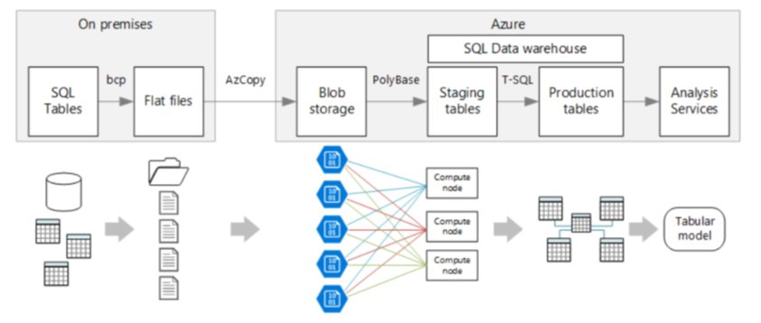

## Overview

SQL Data Warehouse is a "massively parallel processing (MPP) cloud-based, scale-out, relational database capable of processing massive volumes of data."  It actually runs a cluster of SQL Server databases that can expose and process data in ADLS (Azure Data Lake Storage) in a manner similar to Hive.  The use of ADLS means you can scale to petabytes of information whereas Azure SQL Database (SQL Server) is limited to 4 TB.

For a good discussion of the trade-offs between SQL Data Warehouse and SQL Database see

* http://microsoft-bitools.blogspot.com/2017/07/azure-sql-database-vs-azure-sql-data.html

## Data Loading Strategies

The following link offers a step-by-step description of how to load data into SQL Data Warehouse and provides different options at each step.

* https://docs.microsoft.com/en-us/azure/sql-data-warehouse/design-elt-data-loading

The recommended approach is to stage the data first in Blob Storage or ADLS and then to load it using Polybase with CTAS (CREATE TABLE AS) statements.  At first, I was wondering how to lay out the staging file system and how to format the files (csv, parquet, compressed?).  Based on this, it sounds like CTAS ingests the data and creates a new copy inside SQL Data Warehouse.  You don't have to worry about organizing this data other than specifying whether it should be partitioned or replicated across the servers.  Most of the tutorials focus on loading data from CSV or delimited text files.  Gzip compression is supported.  Parquet files (and Snappy compression) is also supported.  I don't know how to transform delimited text files into parquet files without using Spark, so it makes sense to keep the input as delimited text files (since that's how most raw files arrive) and focus on organizing the staging area so that we separate ingestion feeds and know the source and format of each feed.

The diagram below is from the Azure Data Engineering certification class and demonstrates this approach:



## Loading Files from ADLS (Azure Data Lake Storage)

There are several ways to load or expose files from ADLS in SQL Data Warehouse.  There is also a good reference here:

* https://docs.microsoft.com/en-us/azure/sql-data-warehouse/sql-data-warehouse-load-from-azure-data-lake-store
* https://docs.microsoft.com/en-us/azure/sql-data-warehouse/load-data-from-azure-blob-storage-using-polybase

The code below configures the external data source with credentials and a couple of formats:

```
CREATE MASTER KEY;

CREATE DATABASE SCOPED CREDENTIAL OrAdlsCredential
WITH
    IDENTITY = 'ordspadls', -- not actually used?
    SECRET = '<key>'
;

CREATE EXTERNAL DATA SOURCE OrAdlsStage
WITH (
    TYPE = HADOOP,
    LOCATION='abfss://stage@mystorage.dfs.core.windows.net',
    CREDENTIAL = OrAdlsCredential
);

CREATE EXTERNAL FILE FORMAT Parquet
WITH (
    FORMAT_TYPE = PARQUET
);

CREATE EXTERNAL FILE FORMAT ParquetSnappy
WITH (
    FORMAT_TYPE = PARQUET,
    DATA_COMPRESSION = 'org.apache.hadoop.io.compress.SnappyCodec'       
);
The code below then sets up an external table and queries it:

CREATE SCHEMA ext_table;

CREATE EXTERNAL TABLE ext_table (
  ID INT,
  VALUE CHAR(50),
  ...
  CYCLE_DT CHAR(10)
)
WITH (
  LOCATION = 'path/to/parquet',
  DATA_SOURCE = OrAdlsStage,
  FILE_FORMAT = ParquetSnappy
);

SELECT
  CYCLE_DT,
  COUNT(*)
FROM ext_table
GROUP BY
  CYCLE_DT,
  MGT_DIV_NO
;
```

> WARNING: Schema Issues
> It may appear that your external table created successfully, but you can still run into errors when querying it.  The most common errors are data truncation errors (data in the parquet file is too big for the data warehouse column type) or type conversion errors (data type in parquet file is a binary value like 'date' but not loaded as that in SQL DW).  The best way to test that your table was created successfully was to select a few hundred rows with:
>
> ```SELECT TOP 100 * FROM ext_table;```
>
> Make sure you select all columns.  If you don't select a column it won't really test it, and you won't know if your schema is defined correctly or not.
>
> [This link](https://docs.microsoft.com/en-us/sql/relational-databases/polybase/polybase-type-mapping?view=sql-server-ver15) provides a list of type conversions from parquet/hive to SQL DW types.  You should stay within the bounds of these type conversions unless you want to risk having errors.  If your data is stored as a "string" in parquet you have to define it as a string type in (char or varchar) in SQL DW.  You cannot convert it to a numerical type if it is not stored that way in parquet.

> WARNING: Performance Issues
> Even simple queries (like select the top 100 rows) can take a long time to run this way.  This is because Data Warehouse loads the entire data set into its internal storage before it issues any commands.  This is in the process of being improved.  We should see better Spark-like performance that loads only what is necessary in future releases.
