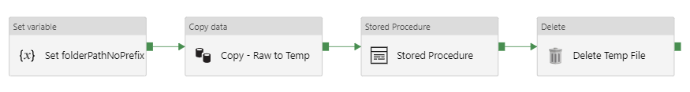
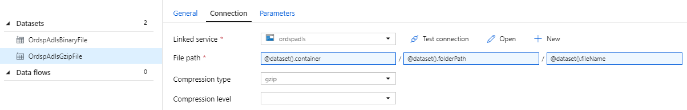

## Overview

Azure natively supports SQL Server, MySQL, MariaDB, and PostgreSQL.  The following table compares prices on these options:

| Option | Specs | Pricing |
|--------|-------|---------|
| Azure SQL Database (SQL Server) | Gen 5 (2 CPUs, 10.2 GB RAM) | $368.19 |
| Azure Database for MySQL | Gen 5 - Basic (2 CPUs) / Gen 5 - General Purpose (2 CPUs) | $59.57 / $153.45 |
| Azure Database for MariaDB | Gen 5 - Basic (2 CPUs) / Gen 5 - General Purpose (2 CPUs) | $59.57 / $153.45 |
| Azure Database for PostgreSQL | Gen 5 - Basic (2 CPUs) / Gen 5 - General Purpose (2 CPUs) | $59.57 / $153.45 |
| Virtual Machine (open source, self-managed database) | B2MS (2 CPUs, 8 GB RAM) / D2 v2 (2 CPUs, 8 GB RAM) | $66.58 / $137.24 |

NOTE: Pricing based on US Central region.  (US East might be cheaper.)  Retrieved on August 26, 2019.  Prices do not include cost of storage (which run about $51.75 for 375 GB.)

SQL Server is the most expensive option.  This is due to requirement of purchasing a license for the software in addition to compute.  The other options (including running your own database on your own virtual machine) are nearly identical in terms of cost.

### Elastic Pools

SQL Server can also make use of Elastic Pools.  This lets multiple databases use the same hardware.  In the table above, if you created a 2 CPU elastic pool you'd pay $368.19 per month for the first database you put on it.  Additional databases would not incur any cost since they run on the same compute nodes.  This is a very cost efficient way to run databases.  You should default to using an elastic pool unless you have a requirement that requires dedicated hardware to keep your database running at top speed 24/7.  If this need arises, you can easily move your database out of the pool and to dedicated hardware.  It's also easy to move it back.

## SQL Server Licensing

Just as an FYI (since these are included in the Azure cost tables above), annual licensing costs for SQL Server are shown below.

| SQL Server 2017 Editions | Ideal for ... | Licensing Model | Open on level price (US$) |
|--------------------|------------------|-----------------|----------------------|
| Enterprise | Comprehensive, mission-critical performance for demanding database and business intelligence requirements. Provides the highest service and performance levels for Tier-1 workloads.[1] | Per core | $14,256 |
| Standard - per core | Core data management and business intelligence capabilities for non-critical workloads with minimal IT resources. | Per core | $3,717 |
| Standard - server + CAL | Core data management and business intelligence capabilities for non-critical workloads with minimal IT resources. | Server + CAL | $931 |
| Developer | Full-featured version of SQL Server software that allows developers to cost-effectively build, test, and demonstrate applications based on SQL Server software. | Per user | Free |
| Express | Free entry-level database that's ideal for learning, as well as building desktop and small server data-driven applications of up to 10 GB. | Not applicable | Free |

source: https://www.microsoft.com/en-us/sql-server/sql-server-2017-pricing

## SQL Database Notes

### Creating New User Accounts

Users are created in three steps:

1. Create a login for the user to login to the SQL Server environment
2. Create a database user that is mapped to the login
3. Assign permissions for that user in a specific database

You can create a new login with:

```
CREATE LOGIN newusername WITH PASSWORD = 'password';
```

You should then switch to the context of the database where you want to create a new user and run this:

```
CREATE USER newusername FOR LOGIN newusername;
```

To keep yourself sane, use the same name within the database as you did for the login (unless you have a really good reason not to).

You can then assign the user 'db_owner' role with:

```
EXEC sp_addrolemember 'db_owner', 'newusername'
```

Azure SQL Database audits will nag you every time you create a new database to create an account other than the system admin that can administer the database.  For this reason, it is best practice to create an admin account for each database and assign it 'db_owner' roles as described above.  This account can then be used to administer that specific database.

TIP: The password you specify in the commands above will never be accessible again.  Remember to be good and store your credentials in Key Vault.  You should do this any time you create a new SQL account.

### Loading Files from Azure Storage (Blob or ADLS)

A great way to get data into an Azure SQL Database is to load files to blob storage or ADLS first and then have the SQL Database load them directly from there.  SQL Database has Polybase support that allows it to reach out to blob storage directly and load files without the need for any intermediary software.

> NOTE: For some annoying reason SQL Database does not support the full Polybase feature set that Azure SQL Data Warehouse uses.  The only way that I've found to load data into SQL Database is to use the Blob API (even if its in ADLS storage) and to access the storage using a SAS token.  SQL Data Warehouse will give you many other options, including:
>
> * Using the storage secret key directly instead of generating a SAS token
> * Querying an ADLS file using OPENROWSET (without having to BULK INSERT it into a table first)
>
> Some of these require TYPE=HADOOP for the external data set whereas SQL Database only supports TYPE=BLOB_STORAGE.

There are several good resources to help with this process:

* https://techcommunity.microsoft.com/t5/Azure-SQL-Database/Loading-files-from-Azure-Blob-Storage-into-Azure-SQL-Database/ba-p/386133
* https://github.com/microsoft/sql-server-samples/blob/master/samples/features/sql-bulk-load/load-from-azure-blob-storage/LoadFromAzureBlobStorage.sql
* https://docs.microsoft.com/en-us/sql/t-sql/statements/create-database-scoped-credential-transact-sql?view=sql-server-ver15

The following process worked for me:

```
CREATE MASTER KEY ENCRYPTION BY PASSWORD='supersecretrandomkey';

CREATE DATABASE SCOPED CREDENTIAL MyAdlsCredentials
WITH
  IDENTITY = 'SHARED ACCESS SIGNATURE',
  SECRET = 'sas_key_beginning_with_qv=';

CREATE EXTERNAL DATA SOURCE MyAdlsDataLake
WITH (
  TYPE = BLOB_STORAGE,
  LOCATION = 'https://yourstorageaccount.blob.core.windows.net/container',
  CREDENTIAL = MyAdlsCredentials
);

CREATE TABLE MY_TABLE (
  ID                 INT NOT NULL PRIMARY KEY,
  VALUE              CHAR(50) NOT NULL
);

BULK INSERT MY_TABLE
FROM 'path/to/myfile.dat'
WITH (
  DATA_SOURCE = 'MyAdlsDataLake',
  FORMAT='CSV',
  CODEPAGE = 65001, --UTF-8 encoding
  FIRSTROW=1,
  FIELDTERMINATOR = '|',
  ROWTERMINATOR = '0x0a',
  TABLOCK
);
```

This will:

1. Create a master encryption key (used later to encrypt credentials)
2. Create a database scoped credential for connecting to your storage account
3. Create an external data source (we use TYPE = BLOB_STORAGE and the "blob.core.windows.net" URL even though it is ADLS)
4. Create a table into which we can load the file
5. Load the file into that table

The BULK INSERT command above is setup for a pipe-delimited text input file.

Assuming you are going to be loading files regularly as part of an ETL process, it is good practice to create a stored procedure for this process.  An example of one used by our team is below:

___Stored Procedure (example)___

```
CREATE PROCEDURE [dbo].[sp_load_my_table]
(
    @file_name VARCHAR(1024)
)
AS
BEGIN

BEGIN TRANSACTION;

CREATE TABLE #MY_TABLE_FILE (
  ID                 CHAR(MAX) NOT NULL PRIMARY KEY,
  VALUE              CHAR(50) NOT NULL
);

DECLARE @sql AS NVARCHAR(MAX);
SELECT @sql = '
BULK INSERT #MY_TABLE_FILE
FROM ''' + @file_name + '''
WITH (
  DATA_SOURCE = ''OpsResearchAdlsDataLake'',
  FORMAT=''CSV'',
  CODEPAGE = 65001, --UTF-8 encoding
  FIRSTROW=1,
  FIELDTERMINATOR = ''|'',
  ROWTERMINATOR = ''0x0a'',
  TABLOCK
);';

EXEC(@sql);

IF @@ERROR <> 0
BEGIN
  ROLLBACK;
  RETURN;
END

MERGE dbo.MY_TABLE AS tar
USING #MY_TABLE_FILE AS src
  ON tar.ID = src.ID
WHEN NOT MATCHED  
THEN INSERT (
    ID,
    VALUE
  )
  VALUES (
    src.ID,
    src.VALUE
  )
WHEN MATCHED  
THEN UPDATE
  SET
    tar.VALUE = src.VALUE;

IF @@ERROR <> 0
BEGIN
  ROLLBACK;
  RETURN;
END

DROP TABLE #MY_TABLE_FILE;

COMMIT TRANSACTION;

END
GO
```

You can then load your file very simply with:

```
EXEC sp_load_my_table 'myfile.20210215.dat';
```

The stored procedure can easily be invoked by other scripts or scheduled in Azure Data Factory.

A couple of things to note about this script:

* We wrap our update in a transaction so it either all succeeds or all fails
* A temporary table is used for the initial file load.  This gives you flexibility when you do the actual insert.  (In the case above it enables us to do a MERGE update.  There is also a CRT_TS field on the target table that is updated automatically when we insert new rows.)
* We have to define an "sql" variable for the "BULK INSERT" command.  This is the only way to have the file name (which is passed as a parameter) injected into the script
* This script does not defend against SQL injection
* We do a MERGE insert/update to avoid deleting existing rows that may not be present in the new files

### Loading Compressed CSV Files Using ADF

One problem we ran into with SQL Database is that it cannot load compressed CSV files.  Our solution was to build a simple Data Factory pipeline that would:

1. Copy the compressed CSV file (".csv.gz") to temporary storage, uncompressing it along the way
2. Invoking a stored procedure to load the uncompressed data
3. Deleting the temporary file

The pipeline below is an example:



This pipeline is built to use two parameters: "folderPath" and "fileName".  These can be passed in from a storage account trigger so that we can trigger the pipeline in response to new files.  We can also run the pipeline manually if we supply these values.  One annoying thing is that "folderPath" contains the container name as the first element.  To simplify working with paths we define a pipeline variable named "folderPathNoPrefix" and set this to the folder path with the container prefix removed.  This is the first activity in the pipeline and is accomplished with the formula:

```
@join(skip(split(pipeline().parameters.folderPath, '/'), 1), '/')
```

We then use a copy activity to copy the compressed CSV file to a temporary location and uncompress it.  To do this we create a generic dataset named "OrdspAdlsGzipFile".  This is defined as a binary file.  In the connection settings (shown below) we have defined "gzip" compression and passed in all the details of this file (container, folderPath, and fileName) as dataset parameters.  The output of the first activity ("Copy - Raw to Temp") is a similar "OrdspAdlsBinaryFile" defined almost identically except that compression type is left to the default value of "none".



The copy activity will copy the file from a container named "raw" to a container named "tmp", uncompressing it along the way.  "folderPathNoPrefix" and "fileName" remain the same (just to keep things simple).  We then invoke the stored procedure in our database (very similar to the template discussed earlier).  We pass in a value of:

```
@concat('tmp/',variables('folderPathNoPrefix'),'/',pipeline().parameters.fileName)
```

This will point to the file in the "tmp" container that we just created.  Since the file is uncompressed, SQL Database can load it easily.  Lastly, we invoke a Delete activity that deletes the temporary file.

When running this pipeline we noticed that any folders created in the "tmp" container will persist even after deleting the file, but that isn't really a big issue.  The files themselves will be deleted, so we are not incurring any storage costs.

### Migrating Data From On-Prem

If you need to copy a lot of data from an on-prem SQL Server database to a SQL Database in Azure, the bulk copy utility is a good choice.  This let's you export data to a tab-delimited file and import it into another database.  When we migrated MINs data we used the following command to export data:

```
bcp "SELECT * FROM my_db.dbo.my_table WHERE YEAR(sales_dt) = 2017" ^
  queryout sales.2017.bcp ^
  -c -T ^
  -S server.company.com
```

This unloaded data to a file named "sales.2017.bcp".  We then imported this into our Azure database with:

```
bcp my_db.dbo.my_table ^
  in sales.2017.bcp ^
  -c -U user ^
  -b 100000 ^
  -S azure-server.database.windows.net
```

This command could take a long time to run.  Typically, the unload is fast but the import is slow.  This might be sped up by copying the data file to a server in the cloud and importing it from there.
