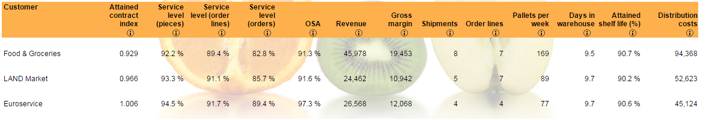

## Overview

The Fresh Connection is an interactive supply chain simulator.  This is a game used to train MIT students on Supply Chain Management, allowing them to put concepts into action in a simulated environment.  The premise of the game is that you are running a company making orange juice products.  The company is losing money and it is up to the heads of 4 key departments to turn this around:

* __Purchasing__ - Determines which component suppliers and contract terms to use for raw materials
* __Operations__ - Determines how to staff the production line.  This includes managing headcount and shifts as well as inspection and quality control training programs
* __Supply Chain Management__ - Manages safety stock for incoming raw materials and outbound finished goods.  Responsible for ensuring we have enough raw materials online to run the production line and enough finished goods to meet customer demand (without spoiling).
* __Sales__ - Sets the purchasing terms for various customers.  Customers pay more for high service levels and long shelf life on the product, but the company will have to pay penalties if they cannot meet the terms to which they agree.

In some cases, a different team member will attend to each of these areas, and they will learn how each of these are inter-related and how they must coordinate efforts.  (You don't want to cut costs on purchasing if it disrupts the production line, and you don't want to promise service levels in sales that you can't meet!)  In our class, we managed everything ourselves.

The game itself was a bit kludgey.  The manual was extensive, and the little help icons embedded in the web pages and reports didn't always work for me.  Sometimes, there just wasn't enough documentation to understand what exactly each variable or checkbox was doing.  This left me guessing about what exactly I was changing in some cases.  Obviously, this was quite frustrating.  But despite these problems, the game still led to some interesting insights and learnings.

## KPIs

The coolest part of The Fresh Connection is its home page and KPI toolbars.  An interactive map is shown, allowing the user to select the business unit they wanted to manage.  This will bring up different KPIs for each unit, with quick call-outs on what is going well and what is going not-so-well.  The user can the drill deeper into each department to access a variety of more detailed reports and start making changes to that part of the business.  The home screen showing the Supply Chain Management department is below, followed by the KPIs for each business unit:

Notice that each business unit is summarized using only 3 KPIs.  The key corporate KPI (ROI) is repeated on each of the dashboards.  Each KPI is also compared to a baseline (in this case the average of the other players in the class) and you bars are color-coded based on whether you are above or below average.

Purchasing:

Operations:

Sales:

I can't help but think about how cool it would be to provide this type of view for my company.  Do you think every VP could give you the two or three KPIs they use to run their business?  In my company we have a tendency to build reports with pages and pages of KPIs without focusing on what the key ones are.  I think focusing on a few KPIs per department would yield very interesting results.

## Finance

The Finance report was also very helpful.  This provided an income statement for each round of the game and provided comparisons to the last round.  This let you find areas of the business where costs were high and prioritize what was most important to fix.  It also helped you see how changes from the last round impacted the bottom line.

## Purchasing

The purchasing department manages activity using the following screen

The key decision they make is to pick a supplier for each component.  Suppliers have different characteristics in terms of locations, lead time, quality, capacity, and service reliability.  I ended up choosing suppliers who were certified, nearby, and had capacity as the reliability and quality from uncertified suppliers was terrible.  How can you manage a supply chain without certainty that you will get what you need from your suppliers?  Redundancy and flexibility in suppliers could help, but that was not an option here.

___Supplier Report:___

___Component Report:___

## Supply Chain

The Supply Chain component of the game was the most relevant to the class.  Strangely, it didn't seem to use much of the analysis or techniques that we had learned.  We had to manage safety stock and lot size (minimum order amount) for inbound components.  We also had to manage the safety stock and production interval for the products we created.  As far as I could tell, there wasn't enough data to get an analytical analysis or approximation of what the optimal values were here.  Safety stock on outbound product should be determined by demand variability (or forecast error).  WAPEs were all around 50%, but it didn't really say 50% of what (weekly demand, I guess).  Obviously, we would want to run as lean as possible.  We'd want to produce in very small batches and would need very small outbound inventories to satisfy demand.  Holding all else constant, it should be possible to optimize just this part of the business and get a huge return on investment.  However, the game didn't give us enough feedback or time to iterate to really get this fine-tuned.  A real production manager could do a much better job with immediate feedback from the production line and being immersed in the data.

One interesting thing was the inventory charts for inbound and outbound items.  These could be used to fine-tune safety stock levels pretty easily.  Intuitively, you want this line to go as close to zero without touching as possible.  If there was a big gap below the line, you could lower inventory levels.  If you were running out-of-stock, you could raise them.  This intuitive approach lets you fine-tune inventory levels given the production interval.  However, you also want to get that production interval down as low as possible.  This is where I was unable to find how the different pieces fit together to allow that.

___Component Report:___

___Product Report:___

## Operations

The operations team would determine the capacity of the inbound and outbound warehouses as well as the labor needed to run these warehouses.  The line charts on the report were good to show peek labor hours.  (It was interesting to see how different this was from just looking at the average).  The report also showed overflow and overtime work.  These proved most useful.  The intuitive job for me was to set the capacity to the point where we only had a tiny bit of overflow.  This ended up being about 80% capacity.  Similarly, I would try to size labor to where we only had a little bit of overtime.  Too much, and costs start running up.  Too little, and it's likely you have more than you need.  This fits in with how we run our operations.  A Director of Operations once told me you want people scheduled just the tiniest bit past capacity.  Then you know they are busy.  Schedule too many hours, and people will be sitting around at times without anything to do - and of course, they will never tell you that this slack is there to reclaim.

___Warehouse Report:___

___Mixing & Bottling Report:___

## Sales

The sales screen let you set the sales contracts with customers.  You had to promise customers a certain service level and shelf life on the product.  Costs of missing the promised service levels could quickly kill your company.  Penalties on missed service levels were the primary thing causing the company to lose money at the beginning.  Later on, spoilage of product because it did not meet customer's promised shelf life terms also was a big cost and driving need for better inventory management.  Essentially, I would set these settings so that I didn't promise what I couldn't deliver.  Beyond that, I'm not sure what else you can do here.  The category management (demand management), and order management options were disabled when we played.

___Customer Report:___

___Product Report:___

