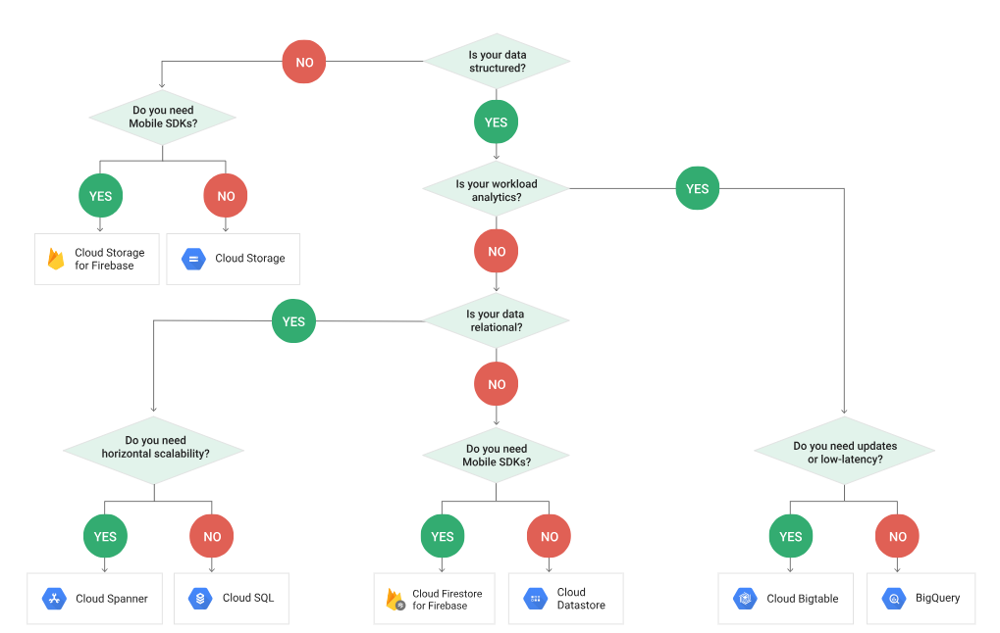

## Overview

The main storage components in GCP are:

| Product | Description | Related Concepts |
|---------|-------------|------------------|
| __Cloud Storage__ | Generic way to store files in collections called "buckets". These can be made to emulate a file system and are the main unit of storage in most applications. These can be used for anything from hosting a static website to fserving as a Data Lake and landing zone for all of your company's data. __Cloud storage costs $0.02 / GB/month (or $20 / TB/month)__ but can be even cheaper if high-performance is not required. | Amazon S3, Key-Value Store for Files/BLOBs, File System |
| __Cloud SQL__ | For OLTP systems. If you need a MySQL or PostreSQL database, this is the place. The Big Data and Machine Learning fundamentals course on Coursera recommended avoiding these if you have more than a 100 GB of data or a few million rows though. When your data begins to grow to that size other tools will likely offer better performance.	| Traditional RDBMS for OLTP applications |
| __Cloud Datastore__ | Document store similar to Mongo that can scale to terabytes of data. Can be used by operational systems.	| Mongo |
| __Cloud Bigtable__ | High-performance database for data that is "narrow" and "long". Very similar to Cassandra. This is a good choice when your data gets too big to be performant, and you have specific, pre-defined queries that allow you to optimize the data for retrieval based on keys. (Good for time series data.) | Cassandra, HBase |
| __BigQuery__ | Used to build data warehouses and data marts (OLAP systems). Google lists this product under "Big Data", but it also has its own internal storage and can be used to replace traditional databases in the data warehouse space. BigQuery can store data internally or expose external data kept in Cloud Storage. External data is typically just CSV, JSON, Avro, or Parquet files kept in a "folder" in Cloud Storage. | Data Warehouse, Hive, Apache Drill |
| __Spanner__ | Mission-critical relational database. (But that comes at a cost. Only needed when Cloud SQL just isn't good enough.) |

## Choosing the Right Storage Option

One of the cool things in GCP is the advice they offer to help you decide what component will best meet your needs.  The following table was taken from the Big Data and Machine Learning Fundamentals course:

|      | Cloud Storage | Cloud SQL | Datastore | Bigtable | Biguery |
|------|---------------|-----------|-----------|----------|---------|
| __Capacity__ | Petabytes+ | Gigabytes | Terabytes | Petabytes | Petabytes |
| __Access metaphor__	| Like files in a file system | Relational database | Persistent Hashmap | Key-value(s), HBase API | Relational |
| __Read__ | Have to copy to local disk | SELECT rows | filter objects on property | scan rows | SELECT rows |
| __Write__ | One file | INSERT row | put object | put row | Batch/stream |
| __Update granularity__ | An object (a "file") | Field	Attribute j| Row | Field |
| __Usage__ | Store blobs | No-ops SQL database on the cloud | Structured data from AppEngine apps | No-ops, high throughput, scalable, flattened data | Interactive SQL* querying fully managed warehouse |

They also offer flowcharts like the one below to help you decide on the best option:

