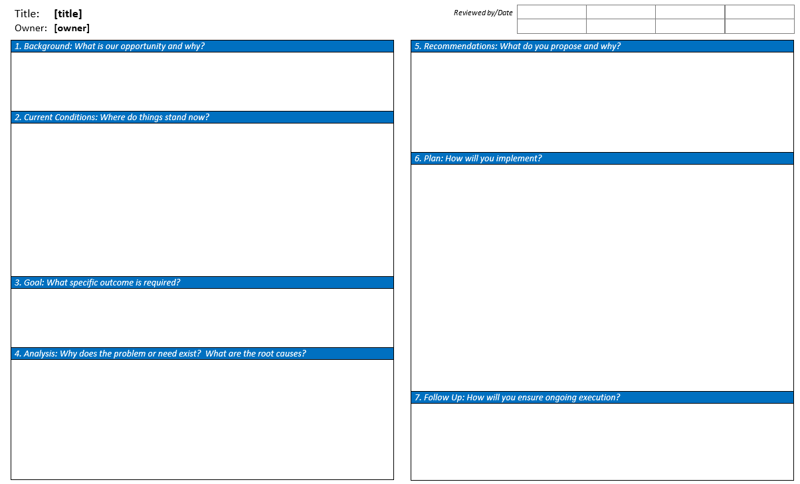

## Overview

"A3" refers to an international size of paper that is roughly 11 x 17 inches.  In Lean circles it has a much different meaning and refers to the problem solving process that is documented on a paper of this size.  An A3 template is provided below:

[Download Word Template](assets/A3 - Template.docx)

## Sections of an A3

The paper is divided into several key sections, described below:

### Title

Names the problem, theme, or issue

### Owner/Date

Identifies who “owns” the problem or issue and the date of the latest revision

### Background

Establishes the business context and importance of the issue

Explain why you are working on this problem and provide any additional background/context necessary to understand this problem in its entirety.

### Current Conditions

Describes what is currently known about the problem or issue

Provide charts and data.  Diagram the current process with storm-clouds identifying problems or gaps in the current process.  Explain how things work today and where the problems are.

### Goals / Targets

Identifies the desired outcome

Now that the gaps in the current process have been identified, describe what the process looks likes when it’s “fixed.”  What improvements would you see if all of the gaps were closed?  (Do not put target state here.  That goes in “countermeasures.”  In this section we are still focusing on the problem and understanding the cost of the gaps.)

### Analysis

Root cause analysis of the situation to determine what has created the gap between the current situation and the desired outcome.

Divide the problem up into sections, each with the root cause of the problem identified.  Can include diagrams, if helpful.  Five Whys.

### Proposed Countermeasures

A proposed set of corrective actions or counter-measures to address the problem, close the gap, or reach the goal

A list of proposed countermeasures (don’t exclude any) that can then be evaluated and ranked based upon how well each addresses the identified causes of this problem.  The highest ranked countermeasures are good candidates for implementation.

### Plan

Prescribes an action plan of who will do what when in order to reach the goal

Include deliverables, timelines, and responsible parties.

### Follow-up

Creates a follow-up review/learning process and anticipates remaining issues.

Schedule follow-up meetings to make sure that the countermeasures being implemented are actually working and to review the A3 process as it was applied to this project.

## Thoughts

For a full description of this process, see the book Managing to Learn: Using the A3 management process to solve problems, gain agreement, mentor, and lead (or my notes, available [here](../personal/assets/Managing to Learn - Using the A3 management process.docx)).  As a simplified description: the A3 process is similar to the [6-Step Problem Solving](six-step-problem-solving) Method.  The key points are to define the problem, identify the root cause of the problem, propose a solution, and then implement and monitor progress of that solution.  As with the problem solving method, it is always good to emphasize that the problem must be properly analyzed, understood, and root causes identified before proposing any solutions.  In terms of the A3 one would usually focus on filling out the "left side" of the A3 first.  The right side should remain blank until the root cause of the problem is understood and all parties involved are aligned in their understanding of the problem.

The primary strength of the A3 is as a communication tool.  It provides a way to document a problem or to document someone's understanding of a problem and gain alignment from all stakeholders during the problem solving process.  The more stakeholders that are involved in the development of the A3, the more buy-in you will have from those stakeholders when you do begin to propose countermeasures that may require their support.  As stated in Managing to Learn, an A3 is not really an A3 until it has been shared with someone else.  The A3 also provides something to "push against", a way to challenge someone's thinking and understanding of a problem without attacking the person themselves.  Writing down a problem and documenting a team's understanding of that problem and the reasoning behind their approaches is a valuable tool to encourage clear thinking, true root cause analysis, and to gain effective alignment on proposed countermeasures.
