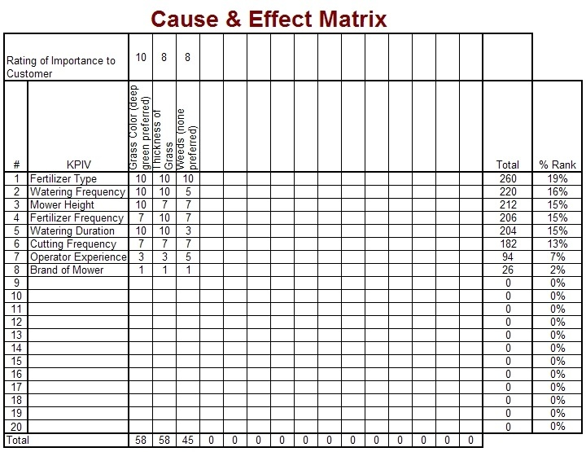

The "Cause & Effect Matrix" ("C&E Matrix", for short) is a way of evaluating proposed plans of actions and ranking them in a quantitative way.  It can be used for evaluating potential causes of a problem (based on their believed effect or impact on the problem) and also for evaluating proposed solutions (based on their expected impact on a problem).  If you're like me, you've probably used this tool before without knowing what it was formally called.  The process is simple:

List the proposed causes or solutions that are being evaluated (one on each row)
List the metrics that will be used to evaluate them in the columns across the top
Provide a numeric measure for each proposal on each of the metrics
Define rankings for how important each metric are to the total
Multiply the scores for each metric by their importance (or do a weighted average) to get a score for each proposal
An example for someone trying to understand how different inputs to lawn care affect the final output is shown below.  In the example, Fertilizer type was shown to be the most important input as it related to the customer expectations for their lawn.  This would lead a team to focus more on that than something that ranked lower (such as brand of mower).

## Variations

When my team at work uses this, we usually are ranking proposal on two key metrics: expected impact and time/complexity to implement.  In this case, the tool is similar to the concept of ["Weighted Shortest Job First"](weighted-shortest-job-first) in Agile development.

I've also seen some practitioners limit the set of numbers that can be used in the rankings.  Instead of allowing 1-10, they instead allow 1,3,5,7,10.  They believe this removes some of the "gray areas" or ambiguity with a continuous numbering system and forces people to decide if a proposal is really worth a high or low score.

## Resources

* [Cause & Effect Matrix](http://blog.gembaacademy.com/2007/06/11/need-help-making-decisions/).  The Gemba Academy.
