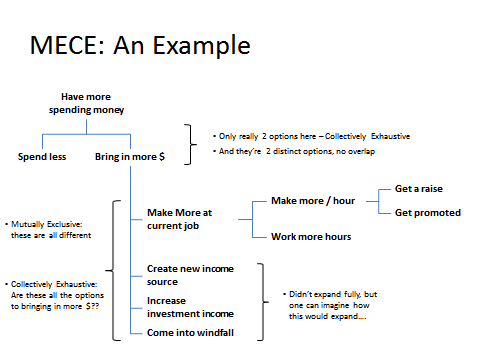

"MECE" stands for "Mutually Exclusive, Collectively Exhaustive".  Scott Heydon showed us this example to make sure we were thinking of every possible cause and every possible solution to a problem.   I suspect this is because we were thinking too much "in-the-box", constrained by what we thought was possible or probable.  This tool can be used either to investigate the cause of a problem or to brainstorm potential solutions.  The idea is to list out every possible cause of or solution to a problem.  At every branch in the tree you should ask yourself if you have enumerated every possibility.  The branches of the tree should be mutually exclusive (i.e. distinct, non-overlapping entities) and collectively exhaustive (representing every potential scenario).  This is similar to a technique used in issue trees.

The example below is a MECE diagram for someone who wants to have more money to spend:

