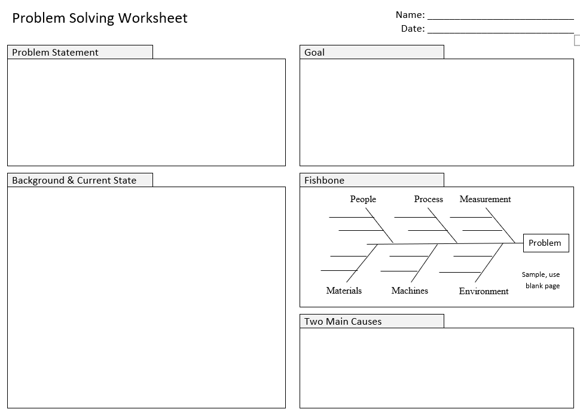
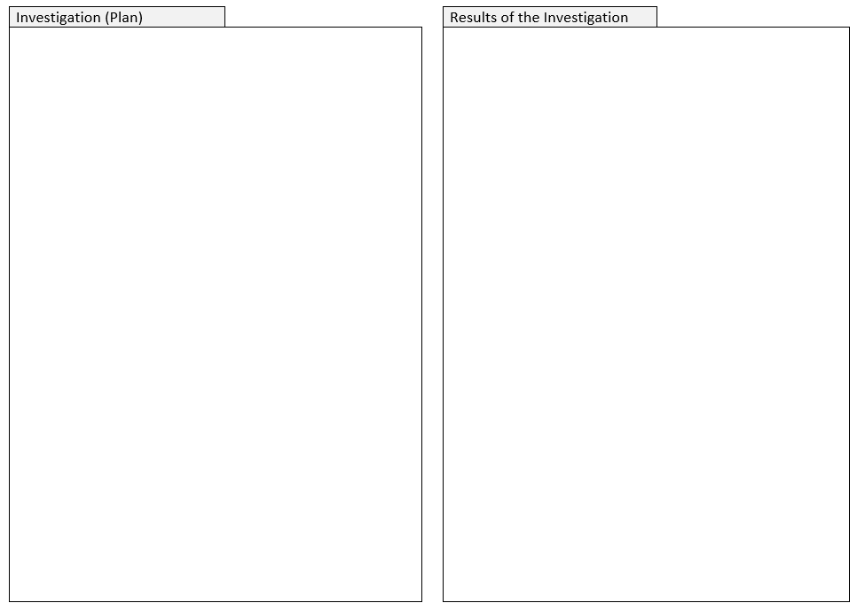
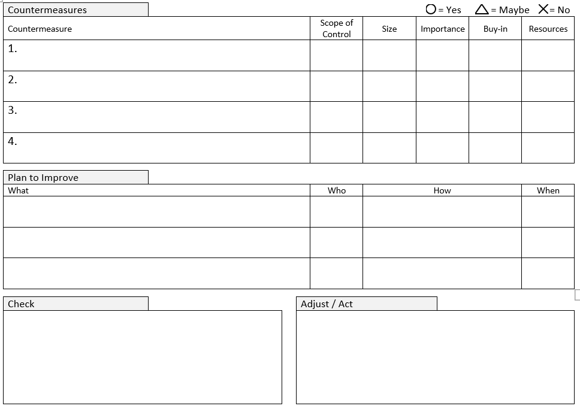

## Overview

The 6-Step Problem Solving Method was introduced to us by Ben Root in his problem solving class.  The 6 steps are:

1. Define the Problem
2. Determine the Root Cause(s) of the Problem
3. Propose Countermeasures
4. Select a countermeasure
5. Implement the countermeasure
6. Evaluate the outcome

The following worksheet was provided to help us work through this method:

[Click Here](assets/Problem_Solving_Worksheet.docx) to download Word Document.

## Key Points

### 1. Define the Problem

The problem should be defined precisely and quantified. A "problem statement" is used to this effect. If there are defects it should indicate the number of defects and how frequently they occur. Ben told us that every problem should express a "deviation from a standard." So what is the standard, and how far away from that standard are we? Personally, I struggle with defining problems in this way, and it was the most difficult part of this class.

### 2. Determine the Root Cause(s) of the Problem

Root causes are brainstormed (using a [Fishbone Diagram](fishbone-diagram)) and two primary causes identified. Once identified, the causes must be investigated, verified, and quantified so that we are sure they are real causes of the problem and so that we know how much improvement to expect when we remove these causes. The most important point in the problem solving class was to STOP HERE until you are sure you understand the problem. Never proceed to develop countermeasures until you are absolutely certain of the root cause and can be certain that your countermeasures will improve the problem by addressing this cause.

### 3. Propose Countermeasures

Brainstorm countermeasures. The idea is to get as many ideas as possible during brainstorming. Don't limit yourself or restrict ideas. That will instead occur in the next step.

NOTE: LEI was very adamant about calling our proposals "countermeasures" and never "solutions." ("Improvements" might also be a good term.) The reason was that they didn't want us to believe that a problem was ever truly solved. Every process can always be improved more, and processes may also change and evolve over time so that a root cause analysis done at one point may become obsolete. |

### 4. Select a countermeasure

 At this step, countermeasures are evaluated. Countermeasures are evaluated based on:

* Scope of control - do we have authority (and ability) to implement this solution?
* Importance - will this have a big impact on the problem?
* Buy-in - do we have (or can we get) "buy-in" from all the parties that will be needed to implement this countermeasure?
* Resources - do we have the resources (time, people, equipment, money) to implement this?

An interesting point in these discussions is that management should be looking for areas where the problem-solving team does not have authority or resources to solve the problem in the way they'd like. These are issues that can be escalated and management can assist in making these solutions feasible.

### 5. Implement the countermeasure

Now that you have a plan, go do it!

### 6. Evaluate the outcome

Measure the result and verify that it obtained the expected outcome. If not, it may mean that you did not address the root cause. Repeat this process as necessary to continually improve processes.

## Class Presentation

The presentation below is a transcription I made of the deck Ben Root used in his class in 2014:

[Download PowerPoint](assets/Team_Problem_Solving_Workshop.pptx)

## Class Structure

Typically, this class is conducted in 3 weekend sessions over the course of 2 months.  The first class introduces steps 1 & 2.  The class will define their problem, brainstorm potential causes, and develop an investigation plan to verify that the causes they identified are truly causing this problem.  Ben said that the difficult part here is to keep people realistic and get them to focus on small problems.  He said most Americans want to "hit a home run" and take on problems that are simply too big for this short class.  Instead, he encourages everyone to pick a small problem and use that to develop your problem solving skills.

After this first session the participants return to work for one month and are expected to perform their investigation.  (This is done as they have time since these are usually side-of-the-desk projects at work).  At the next session they present their root causes and the results of the investigation.  At this point, everyone is expected to have a legitimate root cause so they can proceed to propose countermeasures and select countermeasures to implement.  They then get one more month to implement these countermeasures and return once more to report on the results.  The results are reported to managers who are expected only to observe and encourage - never to critique.

When the Order Evolution team did these we tried doing it during the course of 1 week.  On Monday we did the first class.  On Tuesday we investigated.  On Wednesday we returned to class, but at this point we were struggling.  We had difficulty verifying our root causes and most of us had changed the problem we were working on by this point.  We returned to the stores again Wednesday afternoon to do a second root cause investigation and continued this into Thursday.  We didn't have time to implement our countermeasures or measure the results.  Instead, we just presented on Friday what we would like to implement, and then we disbanded.  This was still a great experience, but we did learn that condensing it into 1 week did not work.  It would have been much more helpful to have sufficient time to spend on this and to actually have implemented a solution and measured its success.

## Key Takeaways

My favorite part of the class was when Ben Root explained that we were not here to learn to problem solve.  "It would be nice if you learned how to problem solve, but that's not why you're here.  You're here to learn how to teach problem solving to others."  He emphasized that the 6 step problem solving method was designed to be taught to front-line workers.  It was simpler than [A3 Problem Solving](a3-problem-solving) (although similar in concept), and intentionally used simple concepts and vocabulary that could be introduced anywhere.  This method was developed for use in factory or production environments, and the real goal is to enable front-line problem solving.  The job of management is then to support this problem solving and to encourage growth and development in newer associates.

Ben also emphasized the danger of introducing problem solving in a company that is not ready for it or totally committed to it.  He asked us what would happen if an eager new associate came up with a solution to a problem, but management then told him he couldn't implement it.  It would likely kill the spirit of innovation and problem solving that you are trying to create.  It is important to introduce problem solving in a controlled way.  Associates coming up with solutions should be encouraged to do so, and management should be very wary of doing anything to discourage this, but it is the job of the problem solver to convince his/her manager that their assessment of the solution and their proposed countermeasure will work.  This is the key to the whole process.  If done correctly, everyone introduced to the problem should be able to follow the reasoning involved.  They should all conclude that the root cause identified is in fact the real problem and that the proposed solution will address this root cause and improve the problem.  If this is the case, everyone should end up being supportive of the solution and willing to give it a try.

The last key take-away involves the description of "Problem Solving Circles" that Ben provided.  At companies that have implemented a Problem Solving culture, continuous problem solving is occurring at all levels of the organization.  In Toyota, every worker participates in problem solving circles and works with a team on some kind of problem.  They present their problem statements, analysis, root causes, and countermeasures are regular meetings in front of management.  This is where management is asked not to critique and not to try and solve any of the team's problems.  Instead, they are just observers.  The most important thing they can do is provide encouragement and to look for problems that are too big for the teams to solve - and where they may need management's involvement to make cross-functional or strategic changes.
