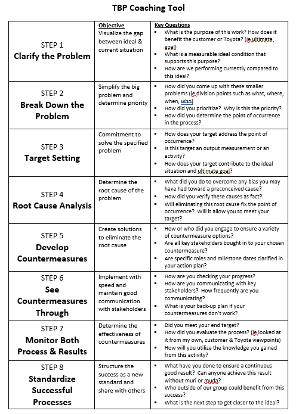

The Toyota Business Practice Coaching Tool was provided to me by a former manager who worked at Toyota.  It is an 8-step problem-solving model that is very similar to [A3 Problem Solving](a3-problem-solving) and the [6-Step Problem Solving](six-step-problem-solving) method that Ben Root taught.  The page below is a copy of the TBP Coaching Tool:

[Click Here](assets/Toyota Business Practice - Coaching Tool.docx) to download Word Doc
