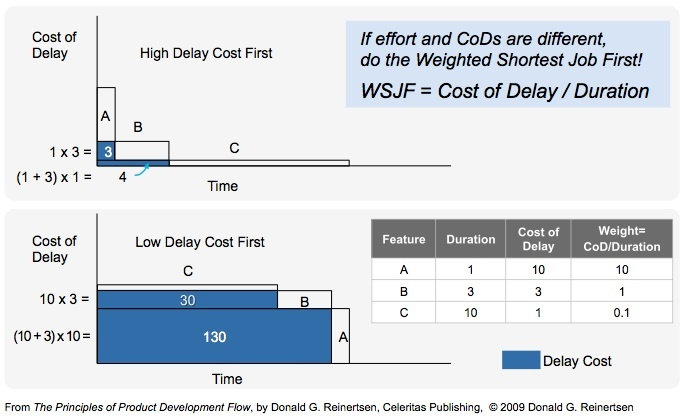

"Weighted Shortest Job First" (WSJF) is not really a Lean tool.  It's something used in Agile software development to prioritize work.  I've only learned about this recently, but it does seem quite useful.  The tool is designed to address the biggest trade-off in any project: potential impact versus time to implement.  If you were to list out all the potential improvements your team could make (to your software or your business as a whole), they will likely fall into two categories:

1. High impact, big projects (that are typically take longer and are most costly/complex to implement)
2. Low impact, small projects (that are typically quicker and simpler to implement)

So which should you take on first?  It can be shown that taking a simple approach of either: 1) always doing high-impact jobs first, or 2) always doing the smallest, fastest jobs first, is sub-optimal.  Instead, a team needs a way to take into account both the potential impact of an enhancement and the time/complexity to implement as factors.  This is exactly what WSFJ does.

The benefit of a project is represented as the "Cost of Delay."  Ideally, this would be the cost (in dollars) for not implementing the change.  As long as this is in common units ($ per day, per week, per month, etc.), we can compare each of our alternatives.  In the SAFe framework, they actually measure this as a number from 1-10, but many argue that it is better to keep this in dollars if at all possible to avoid ambiguity (and I agree).  Then we need to measure the Duration of the project.  Again this can be measured in whatever units (days, weeks, months) are convenient as long as it is the same for all features.  Once again, SAFe measures this on a scale of 1-10, but I agree with those who believe that sticking to actual time measures are better.  Once this is done, we have the two values we need to apply WSJF: the cost of delay and the duration.

The example below illustrates how to apply WSJF for 3 sample features.  WSJF is calculated by taking the cost of delay and dividing by duration.  The first chart shows the result of taking on each project in the order recommended by the WSJF.  The unshaded portions represent the time that the team is working on the proposed enhancement.  The shaded blue area is the time that each feature ends up waiting before work on it begins.  The potential business value that is lost through delay is also represented by the shaded area.

The first chart obviously leads to the least amount of lost business value.  If we were to tackle these features in any other way, the lost value would be increased.  An example of the worst possible solution is shown in the second chart.

## Variations

The SAFe implementation of WSJF describes how the cost of delay is to be calculated User Business Value, Time Criticality, and Risk Reduction-Opportunity Value.  Critics suggest (and I think I agree) that these terms make the calculation more difficult and more subjective.  I also have no idea how these different metrics could be combined by simple addition.  Maybe a [C&E matrix](cause-and-effect-matrix) could combine them with a weighted average based on business importance, but that is certainly making this a more difficult job than it needs to be.  I would prefer to use the WSJF more as a guideline.  Calculate it using as simple and objective a metric as possible and then see what results you get.  If two initiatives are close in value and you want to re-order them based upon some other metric (like risk, complexity, time-criticality, or synergies with other projects) then go ahead and do that.  If you find yourself doing it frequently, then it's time to build the new metric into the calculation.

[One blogger](http://blackswanfarming.com/cost-of-delay-divided-by-duration/) has noted how hard it is to say "Weighted Shortest Job First" and to remember the acronym WSJF.  He instead proposes the acronym "CD3" for "Cost of Delay Divided by Duration."  I think I like this better.  It tells you exactly how to calculate the key metric and it sounds a bit "cooler."

## Splitting Large Jobs up into Small Ones

A beneficial side-effect of using this metric is that it will force you to take a large change request (which might have some high-value pieces combined with lower-value requests) and split it up into smaller requests.  This will be needed in order to get the high-value requests acted upon.  This is actually a good thing and will nudge teams towards being more "agile" (or more "lean") as they direct their work to projects that are both small and high-value.  Larger, more complex requests can still get through, but they will have to have an incredibly high value or cost of delay to do so.  Again, this is a good thing.  The core concept of both lean and agile, is that value should be created in small-batches allowing teams to be more nimble and respond to problems or changing priorities more quickly than competitors.  In fact, one blogger goes as far as to say that:

> One of the most damaging concepts to ever take hold in organisations is that [large-batch projects are a suitable vehicle for developing software](http://blackswanfarming.com/the-problem-with-projects/)

After my recent experiences with I/T (waiting months for requirements, many months more for implementation, and then wondering if what was delivered really was worth the time invested), I completely agree.

## Resources

* [WSJF (Weighted Shortest Job First)](http://www.scaledagileframework.com/wsjf/).  Scaled Agile Framework.
* [Weighted Shortest Job First](http://blackswanfarming.com/wsjf-weighted-shortest-job-first/).  Black Swan Farming.
* [CD3: Cost of Delay Divided by Duration](http://blackswanfarming.com/cost-of-delay-divided-by-duration/).  Black Swan Farming.
* [Problems I have with SAFe-style WSJF](http://jchyip.blogspot.co.uk/2012/12/problems-i-have-with-saf-style-wsjf.html).  Jason Yip's blog.
