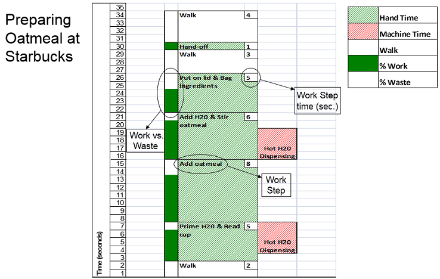

One of the most interesting experiences I've had at my job is sitting in two days worth of Mr. Potato Head training.  It's fun to tell your wife and kids that you got paid to sit around and watch someone build Mr. Potato Head all morning.  This class was conducted by Scott Heydon from Starbucks/LEI.  It is based on a class he teaches to students at Dartmouth.  The goal is to teach people how to observe work in an organized and structured way.  It also gets into process improvement techniques.

## Work Stories

The output of structured work observation is a list of steps in a process, expected times for each step, and an understanding of what components of a process are waste instead of value.  All of this can be displayed visually as a work story.  A sample work story is below:

## ERACS

ERACS was a method for identifying ways to remove waste in processes and thereby improve them.  ERACS stands for:

* __Eliminate__ unnecessary elements
* __Rearrange__ elements (layout) for better sequencing (flow)
* __Add/Subtract__ elements altogether OR to other jobs (offline)
* __Combine__ elements when practical
* __Simplify__ all necessary elements to make job easier, faster & safer

## Mr. Potato Head Class Materials

Below is a presentation that Scott presented during his Potato Head training.  I've also written up a description of what he did as he walked us through some of the hands-on portions of the exercise, highlighting key lessons and concepts he threw in along the way.

* [Power Point Presentation](assets/Manager as Coach.pptx) - Scott Heydon, LEI
* [Write-up Describing Hands-on Portion of Class](assets/Mr Potato Head - Learning Exercise.docx) - Dan Rogers
* [Observing Work Process Sheet](assets/LEI - Observing Work Process Sheet.pdf) - Handout used for writing down the steps in a process and timing them.
